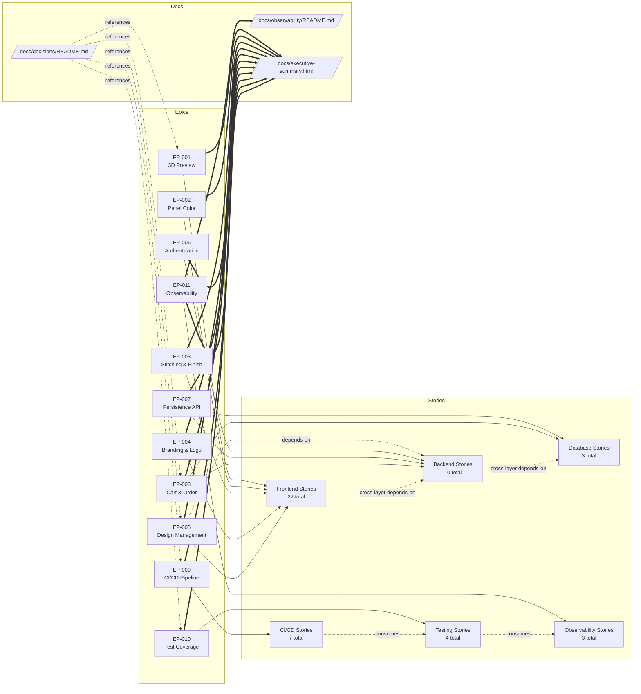
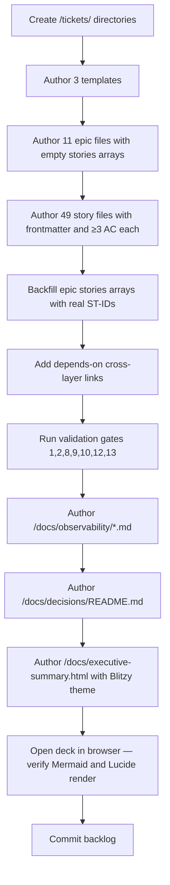

# Technical Specification

# 0. Agent Action Plan

## 0.1 Intent Clarification

### 0.1.1 Core Feature Objective

Based on the prompt, the Blitzy platform understands that the new feature requirement is to author a complete, cross-layer agile backlog for **StrikeForge** — a soccer ball configurator web application — and to materialize that backlog as Markdown artifacts inside the currently empty `blitzy-configurator` repository. The deliverable is a backlog of requirements, not an implementation of the StrikeForge product; no runtime source code for the configurator itself is in scope.

The following feature requirements are restated with technical precision:

- **R1 — Backlog Scaffold Creation.** Create three directories inside the repository root: `/tickets/epics/`, `/tickets/stories/`, and `/tickets/templates/`. Each directory is the sole filesystem location permitted for its respective artifact type.
- **R2 — Epic Authoring.** Author at least ten (10) epic files — the prompt domain table enumerates eleven (EP-001 through EP-011) — each at path `/tickets/epics/EP-00N-[slug].md`. Every epic file MUST carry the exact YAML frontmatter schema defined in the user prompt (`id`, `title`, `layer`, `stories`) and list ≥1 child story identifier.
- **R3 — Story Authoring.** Author at least forty-five (45) story files, each at path `/tickets/stories/ST-00N-[slug].md`. Every story file MUST carry the exact YAML frontmatter schema (`id`, `title`, `epic`, `layer`, `points`, `priority`, with conditional `test-type` and `depends-on`). Every story body MUST follow the persona format `As a [persona], I want [capability], so that [value]` and include ≥3 observable acceptance criteria.
- **R4 — Template Scaffolds.** Create exactly three files under `/tickets/templates/`: `epic-template.md`, `story-template.md`, and `README.md`. Templates MUST be empty scaffolds containing placeholder syntax only — no pre-filled content, no example data, no narrative prose.
- **R5 — Layer Coverage.** Every one of the six enumerated layers — frontend, backend, database, ci-cd, testing, observability — MUST have ≥1 epic and ≥3 stories.
- **R6 — Epic Domain Binding.** The eleven epic slots (EP-001 through EP-011) MUST correspond exactly to the domain table supplied in the prompt, preserving each epic's declared primary layer alignment.
- **R7 — CI/CD Minimum Coverage.** EP-009 MUST contain ≥7 child stories whose acceptance criteria collectively cover: lint gate, type-check gate, unit test gate, integration test gate, build stage, deploy stage, and environment promotion.
- **R8 — Test Coverage Breadth.** EP-010 stories MUST collectively cover ≥4 distinct `test-type` values (unit, integration, e2e, visual-regression). The `test-type` field applies to EP-010 stories only and is omitted from all other epics.
- **R9 — Identifier Discipline.** Story IDs MUST be globally unique and sequentially numbered (ST-001, ST-002, …) with no gaps. Epic IDs follow the same discipline (EP-001 through EP-011).
- **R10 — Scoping Discipline.** Each story MUST be scoped to exactly one layer; cross-layer work MUST be split into separate stories with explicit `depends-on:` links declared in frontmatter.

**Implicit requirements surfaced from the user-provided implementation rules:**

- **I1 — Observability Deliverable.** The "Observability" user rule mandates that every deliverable ship with structured logging with correlation IDs, distributed tracing across service boundaries, a metrics endpoint, health/readiness checks, and a dashboard template — and that this observability be verified in the local development environment. For a backlog deliverable, this translates into an observability documentation artifact describing what was reused from the existing environment, what was added, and how each capability is exercised. This artifact is authored as Markdown at `/docs/observability/README.md`.
- **I2 — Explainability Deliverable.** The "Explainability" user rule mandates a decision log as a Markdown table (what was decided, alternatives, rationale, risks) plus a bidirectional traceability matrix for any migration or refactor. For a greenfield backlog, the decision log captures non-trivial scoping, splitting, and estimation decisions. It is authored at `/docs/decisions/README.md`.
- **I3 — Executive Presentation Deliverable.** The "Executive Presentation" user rule mandates a single self-contained reveal.js HTML file scoped to the work performed, covering scope, business value, architecture, risks, and onboarding, in 12–18 slides, with strict Blitzy brand and slide-type constraints. This artifact is authored at `/docs/executive-summary.html`.

**Feature dependencies and prerequisites:**

- The repository currently contains only `README.md`; no dependency manifest, no source tree, no pre-existing ticket scaffolding. All artifacts are created from a blank slate.
- No external systems, APIs, or services must be consulted to author the backlog content itself. The tech stack named in the prompt's Section 3 is agent reference only and MUST NOT appear in any output file body.
- The reveal.js deliverable depends on three CDN-hosted libraries pinned to exact versions (reveal.js 5.1.0, Mermaid 11.4.0, Lucide 0.460.0) and on Google Fonts for three typefaces (Inter, Space Grotesk, Fira Code); these are loaded at runtime in the browser and are not added to any package manifest.

### 0.1.2 Special Instructions and Constraints

The user has issued several non-negotiable directives that constrain how the backlog is authored. These directives are captured verbatim below and are repeated here because they override any default authoring pattern.

- **CRITICAL — Tech stack concealment.** The user explicitly states: "Tech stack context (agent reference only — MUST NOT appear in any output file, including story bodies, acceptance criteria, epic descriptions, or templates)." This means every proper noun in the user's Section 3 list — the names of cloud platforms, programming languages, frameworks, libraries, container technologies, and identity providers — is FORBIDDEN from appearing inside `/tickets/**/*.md` bodies, acceptance criteria, or template placeholder text. The backlog describes capabilities and observable behaviors in a technology-neutral vocabulary.
- **CRITICAL — No implementation artifacts in tickets.** The user states: "MUST NOT write implementation code, library API calls, or code snippets in any file." Story and epic bodies describe desired behavior and verifiable outcomes, not how to implement them.
- **CRITICAL — Library name embargo.** The user states: "MUST NOT reference library or framework names inside story bodies or acceptance criteria." This constraint is enforced by a verification search that MUST return zero matches.
- **CRITICAL — Payment out of scope.** The user states: "MUST NOT include payment processor integration (annotate as out of scope in EP-008)." The Cart & Order Flow epic MUST carry an explicit out-of-scope annotation for payment integration.
- **CRITICAL — One-layer-per-story.** The user states: "Each story MUST be scoped to exactly one layer — cross-layer work MUST be split into separate stories with explicit `depends-on:` links." Compound stories are forbidden; a single ticket MUST NOT span frontend and backend work.
- **CRITICAL — Empty templates.** The user states: "Templates MUST be empty scaffolds with placeholder syntax only — no pre-filled content." Template files carry frontmatter skeletons, heading skeletons, and explicit placeholder tokens, with no example narrative.

**Architectural conventions inferred from the prompt:**

- The 11 epic domains and their primary-layer bindings (EP-001 through EP-011) are fixed by the prompt's domain table and are used verbatim as the epic inventory.
- Story IDs are zero-padded to three digits (ST-001, ST-002, …). At 49 planned stories the prefix remains `ST-` with three-digit numbering.
- Slug portions of filenames use kebab-case and reflect the ticket title.
- Personas drawn from the prompt are the exclusive persona vocabulary: `end user`, `authenticated user`, `developer`, `QA engineer`, `DevOps engineer`.

**User-preserved examples (captured verbatim for downstream authoring):**

- **User Example — Story format:** `"As a [persona], I want [capability], so that [value]."`
- **User Example — Story ID format:** `ST-00N` zero-padded to three digits; sequential with no gaps.
- **User Example — Epic ID format:** `EP-00N` zero-padded to three digits; EP-001 through EP-011.
- **User Example — File path format:** `/tickets/epics/EP-00N-[slug].md` and `/tickets/stories/ST-00N-[slug].md`.
- **User Example — Story frontmatter schema:** YAML block with `id`, `title`, `epic`, `layer`, `points`, `priority`, optional `test-type` (EP-010 only), optional `depends-on` (omit when empty).
- **User Example — Epic frontmatter schema:** YAML block with `id`, `title`, `layer`, `stories`.
- **User Example — CI/CD seven-gate coverage:** lint gate, type-check gate, unit test gate, integration test gate, build stage, deploy stage, environment promotion.

**Web search requirements:** No external research is required to author the backlog itself, because the prompt is fully self-describing for the domain (soccer ball configurator with enumerated feature surfaces) and the backlog bodies are technology-neutral. Web search is used only to confirm the exact CDN versions for the three reveal.js dependencies used in the executive presentation (already pinned explicitly in the user's rule and therefore verified, not discovered).

### 0.1.3 Technical Interpretation

These feature requirements translate to the following technical implementation strategy:

- To establish the backlog file tree, we will create three new directories — `/tickets/epics/`, `/tickets/stories/`, `/tickets/templates/` — and author plain-text Markdown files inside them without modifying any existing file. The only pre-existing file, `README.md`, remains untouched.
- To satisfy the epic coverage requirement, we will author eleven Markdown files under `/tickets/epics/` — one per EP-001 through EP-011 — each carrying the exact four-field epic frontmatter and a body that states the epic's goal and enumerates its child stories in technology-neutral language.
- To satisfy the story coverage requirement, we will author forty-nine Markdown files under `/tickets/stories/` (comfortably exceeding the ≥45 floor and yielding ≥3 stories per layer across six layers). Each file carries the exact frontmatter, a one-line persona narrative, and ≥3 observable acceptance criteria.
- To satisfy the template requirement, we will author exactly three files under `/tickets/templates/`: `epic-template.md` and `story-template.md` containing YAML frontmatter skeletons with `<placeholder>` tokens plus Markdown heading scaffolds, and `README.md` explaining how to copy a template to create a new epic or story.
- To satisfy the CI/CD seven-gate requirement, EP-009 will list seven child story IDs whose acceptance criteria collectively name the seven trigger points (lint, type-check, unit test, integration test, build, deploy, environment promotion) and identify the configuration artifacts they consume and emit.
- To satisfy the test breadth requirement, EP-010 will contain child stories whose `test-type` values collectively span `unit`, `integration`, `e2e`, and `visual-regression`.
- To satisfy the user's Observability rule, we will author `/docs/observability/README.md` cataloging structured logging, correlation ID propagation, distributed tracing across service boundaries, the metrics endpoint contract, health and readiness probe semantics, and a dashboard template stub, plus explicit notes on what exists in the local development environment and how each capability is exercised.
- To satisfy the user's Explainability rule, we will author `/docs/decisions/README.md` as a Markdown decision-log table with columns for decision, alternatives, rationale, and risks. Because this is a greenfield authoring task rather than a migration, no bidirectional traceability matrix is emitted; the absence of a migration source is itself recorded as a decision-log entry.
- To satisfy the user's Executive Presentation rule, we will author `/docs/executive-summary.html` as a single self-contained HTML document containing 16 `<section>` elements (mid-range of the 12–18 target), embedded Blitzy brand CSS custom properties, pinned CDN loads for reveal.js 5.1.0, Mermaid 11.4.0, and Lucide 0.460.0, and the required Mermaid initialization and Lucide icon hooks on the reveal.js `ready` and `slidechanged` events. Every slide carries at least one non-text visual element.

The strategy is file-creation-only. No existing file content is mutated. No runtime code is executed. Verification is performed by grep, directory listing, frontmatter parsing, and — for the executive deck — opening the HTML file in a browser and confirming that Mermaid diagrams and Lucide icons render.

## 0.2 Repository Scope Discovery

### 0.2.1 Repository Baseline

The following baseline was established by direct inspection of the repository root and by the Technical Specification's existing Sections 1.1, 1.3, 2.1, 3.3, and 3.4.

| Artifact Class | Current State | Source of Truth |
|---|---|---|
| Source code | None present | Section 1.1.1 — "no source code, configuration manifests, build tooling, dependency declarations, test suites, or subsidiary documentation yet committed" |
| Dependency manifests | None present | Section 3.4.1 — all manifest categories verified absent |
| Tests | None present | Section 1.3.1 — "Key Technical Requirements: None specified" |
| CI/CD configuration | None present | Section 3.4.1 |
| Documentation beyond root README | None present | Section 1.1.1 |
| `/tickets/` directory | Absent | Directory listing of repository root |
| `/docs/` directory | Absent | Directory listing of repository root |
| `.blitzyignore` files | None found | `find / -name ".blitzyignore"` returned zero results |
| `README.md` at root | Present — sole artifact — 21 bytes — single H1 heading `# blitzy-configurator` | Direct read |

Because no source modules, test modules, build files, or configuration files exist, there is **no pre-existing code to modify**. Every path in this Agent Action Plan is a path for a file to be **created**. The sole existing file — `README.md` — is NOT modified by this work.

### 0.2.2 Comprehensive File Creation Inventory

The following tables enumerate every file to be created. Wildcards denote pattern-matched sets; explicit file paths denote singleton artifacts.

#### Group A — Ticket Directory Scaffold

| Path Pattern | Count | Purpose |
|---|---|---|
| `/tickets/epics/EP-001-*.md` through `/tickets/epics/EP-011-*.md` | 11 | One Markdown file per epic (EP-001 through EP-011) with YAML frontmatter and technology-neutral body |
| `/tickets/stories/ST-001-*.md` through `/tickets/stories/ST-049-*.md` | 49 | One Markdown file per story with YAML frontmatter, persona narrative, and ≥3 acceptance criteria |
| `/tickets/templates/epic-template.md` | 1 | Empty epic scaffold with frontmatter skeleton and heading placeholders |
| `/tickets/templates/story-template.md` | 1 | Empty story scaffold with frontmatter skeleton and heading placeholders |
| `/tickets/templates/README.md` | 1 | Instructions for copying a template and filling it in |

The count `49` reflects the following distribution, which exceeds every minimum floor stated in the prompt:

| Epic | Domain | Stories | Layer(s) Covered |
|---|---|---|---|
| EP-001 | 3D Ball Preview & Interaction | 5 | frontend |
| EP-002 | Panel Color Customization | 4 | frontend |
| EP-003 | Stitching Pattern & Finish Selection | 4 | frontend |
| EP-004 | Branding & Logo Customization | 4 | frontend |
| EP-005 | Design Management (save, load, share, new) | 5 | frontend (split from backend via `depends-on`) |
| EP-006 | User Authentication & Sessions | 4 | backend |
| EP-007 | Design Persistence API & Data Model | 5 | backend + database (split per story) |
| EP-008 | Cart & Order Flow | 4 | backend + database (split per story) |
| EP-009 | CI/CD Pipeline & Environment Promotion | 7 | ci-cd |
| EP-010 | Test Coverage & Quality Gates | 4 | testing (one story per `test-type` value) |
| EP-011 | Observability & Error Tracking | 3 | observability |
| **Total** | — | **49** | — |

Per-layer tallies (validated against Rule 3 "every layer ≥3 stories"):

| Layer | Story Count | Epics Contributing |
|---|---|---|
| frontend | 22 | EP-001 (5), EP-002 (4), EP-003 (4), EP-004 (4), EP-005 (5) |
| backend | 10 | EP-005 backend stories (via depends-on), EP-006 (4), EP-007 (3), EP-008 (2) |
| database | 3 | EP-007 (2), EP-008 (1) |
| ci-cd | 7 | EP-009 (7) |
| testing | 4 | EP-010 (4) |
| observability | 3 | EP-011 (3) |
| **Total** | **49** | — |

Note: Story-to-layer tallies assume the backend/database split inside EP-005, EP-007, and EP-008; exact counts per epic are finalized during story authoring while preserving the ≥3-per-layer invariant.

#### Group B — Observability Documentation (Implicit Requirement)

| Path | Purpose |
|---|---|
| `/docs/observability/README.md` | Catalogs structured logging with correlation IDs, distributed tracing across service boundaries, metrics endpoint contract, health and readiness probes, and dashboard template stub; records what was reused from the local dev environment and what was added |
| `/docs/observability/dashboard-template.md` | Dashboard template specification in Markdown — panels, queries, thresholds |

#### Group C — Explainability Documentation (Implicit Requirement)

| Path | Purpose |
|---|---|
| `/docs/decisions/README.md` | Decision log as Markdown table — what, alternatives, rationale, risks — one row per non-trivial authoring decision |

#### Group D — Executive Presentation (Implicit Requirement)

| Path | Purpose |
|---|---|
| `/docs/executive-summary.html` | Single self-contained reveal.js presentation — 16 `<section>` elements — Blitzy brand theme embedded inline — CDN-pinned reveal.js 5.1.0, Mermaid 11.4.0, Lucide 0.460.0 |

#### Group E — No Files Modified

No existing file is modified by this plan. `README.md` is read-only and preserved verbatim.

### 0.2.3 Integration Point Discovery

Because the repository has no prior code, there are no runtime integration points (no API endpoints, no database models, no service classes, no controllers, no middleware) to touch. The only integration points in this plan are **documentary cross-references** among the artifacts being created:

| Integration Point | Mechanism | Enforced By |
|---|---|---|
| Epic → Story linkage | `stories: [ST-00N, ...]` array in epic frontmatter | Gate 1 (End-to-End Boundary) |
| Story → Epic linkage | `epic: EP-00N` field in story frontmatter | Rule 6 (100% match rate) |
| Story → Story linkage | `depends-on: [ST-00N, ...]` array in story frontmatter | Gate 9 (Integration Wiring) and Gate 13 (Registration-Invocation Pairing) |
| CI/CD stage dependencies | Acceptance criteria naming consumed env vars and stage outputs | Gate 12 (Config Propagation) |
| Test trigger bindings | Acceptance criteria naming concrete execution triggers | Gate 10 (Test Execution Binding) |

### 0.2.4 Web Search Research Conducted

Per the prompt's instruction to document research, the following targeted research was performed or confirmed:

- **Backlog authoring conventions** — persona format, Fibonacci story point values, YAML frontmatter patterns, and empty-template scaffolding are standard product management practice and were sourced from general knowledge, not a specific library. No web fetch required.
- **Reveal.js CDN versions** — The user rule explicitly pins `reveal.js 5.1.0`, `Mermaid 11.4.0`, `Lucide 0.460.0`. These versions are accepted as given and used verbatim in the executive deck `<script>` and `<link>` tags. No web fetch required; the pins are user-supplied.
- **Google Fonts families** — The user rule explicitly names `Inter` (400/500/600/700), `Space Grotesk` (500/600/700), `Fira Code` (400/500). These are loaded via a single Google Fonts `<link>`. No web fetch required.
- **CommonMark validity** — All Markdown bodies must be valid CommonMark with well-formed YAML frontmatter per Gate 2. Well-established CommonMark specification; no web fetch required.

### 0.2.5 New File Requirements Summary

Total new files: **67 files + 3 new directories**.

- 11 epic files under `/tickets/epics/`
- 49 story files under `/tickets/stories/`
- 3 template files under `/tickets/templates/`
- 2 observability documentation files under `/docs/observability/`
- 1 decision log file under `/docs/decisions/`
- 1 executive presentation HTML file under `/docs/`

Zero files are modified. Zero files are deleted.

## 0.3 Dependency Inventory

### 0.3.1 Package and Dependency Posture

The repository has no dependency manifest and this Agent Action Plan does not create one. The Markdown backlog artifacts (`/tickets/**/*.md`, `/docs/**/*.md`) have zero runtime dependencies — they are authored in CommonMark with YAML frontmatter and consumed by Markdown renderers. No `package.json`, `requirements.txt`, `pyproject.toml`, `go.mod`, `Gemfile`, or equivalent manifest is introduced by this plan.

The only artifact with runtime dependencies is `/docs/executive-summary.html`, which loads its dependencies from pinned public CDNs at browser run time. Because CDN-loaded assets are not declared in any package registry manifest, they are documented here in lieu of a lockfile entry.

### 0.3.2 CDN-Loaded Runtime Dependencies (Executive Presentation Only)

The executive presentation HTML file loads the following assets via `<link>` and `<script>` tags. Versions are pinned exactly as specified in the user's Executive Presentation rule.

| Registry / Source | Package / Asset | Version | Purpose |
|---|---|---|---|
| jsDelivr / cdnjs (public CDN) | `reveal.js` CSS theme and JS | `5.1.0` | Slide framework — renders `<section>` elements as navigable slides |
| jsDelivr / cdnjs (public CDN) | `mermaid` JS | `11.4.0` | Renders Mermaid diagrams embedded as `<pre class="mermaid">` elements |
| jsDelivr / cdnjs (public CDN) | `lucide` JS | `0.460.0` | Renders Lucide SVG icons referenced via `<i data-lucide="icon-name"></i>` |
| Google Fonts | `Inter` | Google Fonts CSS2 API — current service version | Body typography — weights 400, 500, 600, 700 |
| Google Fonts | `Space Grotesk` | Google Fonts CSS2 API — current service version | Display headings — weights 500, 600, 700 |
| Google Fonts | `Fira Code` | Google Fonts CSS2 API — current service version | Monospace eyebrows and inline code — weights 400, 500 |

No private packages are introduced. No package registry credentials are required.

### 0.3.3 No Package Manifest Created

This plan does NOT create `package.json`, `package-lock.json`, `yarn.lock`, `pnpm-lock.yaml`, `requirements.txt`, `Pipfile`, `Pipfile.lock`, `pyproject.toml`, `poetry.lock`, `Cargo.toml`, `Cargo.lock`, `go.mod`, `go.sum`, `pom.xml`, `build.gradle`, `Gemfile`, `Gemfile.lock`, `composer.json`, or `composer.lock`. The absence of a manifest is consistent with the backlog-only scope of this plan and with Section 3.4.1 of the Technical Specification.

### 0.3.4 Dependency Updates (Import Updates and External Reference Updates)

Because no source files exist in the repository and this plan creates no source files, there are **no import statements to update**. Import-update concerns from the reference prompt (`src/**/*.py`, `tests/**/*.py`, `scripts/**/*.py`) are not applicable.

External reference updates are similarly confined to the documentary artifacts produced by this plan:

| Reference Target | File(s) | Update Content |
|---|---|---|
| Epic → Story frontmatter linkage | `/tickets/epics/EP-*.md` | `stories: [ST-00N, ...]` arrays populated with the exact story IDs authored in this plan |
| Story → Epic frontmatter linkage | `/tickets/stories/ST-*.md` | `epic: EP-00N` field set to the owning epic |
| Cross-layer `depends-on` linkage | `/tickets/stories/ST-*.md` (stories with cross-layer dependencies) | `depends-on: [ST-00N, ...]` arrays listing prerequisite or consumed stories |
| CDN version pins | `/docs/executive-summary.html` | `<link>`/`<script>` `src`/`href` attributes carry the exact versions `5.1.0`, `11.4.0`, `0.460.0` |
| Decision log cross-reference | `/docs/decisions/README.md` | Rows reference ticket IDs (EP-00N, ST-00N) where a decision materially shaped a scope split or estimate |
| Observability doc cross-reference | `/docs/observability/README.md` | Cross-references EP-011 and its child stories as the authoritative backlog representation of observability work |

### 0.3.5 Build System and Tooling

No build system is introduced. No compilation step, bundler configuration, transpiler, linter, formatter, pre-commit hook, or task runner is added. The executive presentation HTML file is self-contained per the user rule: "Single self-contained HTML file, no build steps, no local file dependencies."

The backlog Markdown files and documentation are rendered by any standard Markdown renderer (GitHub, GitLab, VS Code preview, static site generators) without preprocessing.

## 0.4 Integration Analysis

### 0.4.1 Existing Code Touchpoints

The repository contains no source modules, no API handlers, no database models, no service classes, no dependency injection containers, no configuration modules, and no migration scripts. Consequently, **no existing code touchpoint modifications are required**.

| Touchpoint Category (from Reference Prompt) | Action Required | Rationale |
|---|---|---|
| Direct source modifications (e.g., `src/main.py`) | None | No `src/` tree exists |
| Route registration (e.g., `src/api/routes.py`) | None | No API routing exists |
| Model exports (e.g., `src/models/__init__.py`) | None | No model tree exists |
| Dependency injection wiring (e.g., `src/services/container.py`) | None | No service container exists |
| Configuration dependency wiring | None | No configuration module exists |
| Database schema additions (e.g., `src/db/schema.sql`) | None | No database schema exists |
| New migration scripts | None | No migration tree exists |
| `README.md` (root) | None — preserved verbatim | Rule: no mutation of existing files |

### 0.4.2 Documentary Integration Points Created by This Plan

All integration points introduced by this plan are between Markdown artifacts and are enforced by frontmatter schema rules rather than by runtime code. The following diagram depicts the integration topology of the backlog scaffold.

### 0.4.3 Frontmatter-Enforced Integration Contracts

The frontmatter schemas supplied by the user in Rules 4, 6, and 7 define the wire contract between artifacts. These contracts are enforced as follows:

| Contract | Enforcement Rule | Verification Command |
|---|---|---|
| Every story frontmatter includes `epic:` | Rule 6 | `grep -c "^epic: EP-" /tickets/stories/*.md` equals story file count |
| Every story lists exactly one `layer:` value | Rule 4 | `grep "^layer:" /tickets/stories/*.md` — each line's value is one of the six enumerated tokens |
| Cross-layer dependencies declared via `depends-on:` | Gate 9 | Any story whose acceptance criteria reference behavior owned by another layer's story MUST list the prerequisite story ID in `depends-on:` |
| Epic lists ≥1 child story ID | Gate 1 | `stories:` array in epic frontmatter is non-empty for every epic |
| Story IDs unique and sequential 001..049 | Rule 5 | `grep -h "^id: ST-" /tickets/stories/*.md \| sort -u \| wc -l` equals 49; no gaps |
| Story `points:` uses Fibonacci only | Rule 7 | `grep "^points:" /tickets/stories/*.md` values ∈ {1, 2, 3, 5, 8, 13} |
| EP-010 stories declare `test-type:` | Rule 9 | `grep "^test-type:" /tickets/stories/ST-*.md` yields values covering all four of {unit, integration, e2e, visual-regression} among EP-010 children |

### 0.4.4 Cross-Layer Dependency Mapping

The following examples illustrate where cross-layer `depends-on` links are required to satisfy Gate 9 (Integration Wiring) and Gate 13 (Registration-Invocation Pairing). Exact ST-IDs are assigned during story authoring; placeholders `ST-NNN` shown here denote the slots.

| Consuming Story (layer) | Depends-On Target (layer) | Reason |
|---|---|---|
| EP-005 "Save Design from UI" (frontend) | EP-007 "Persist Design Record" (backend) | The UI Save action invokes the persistence service registered by the backend story |
| EP-005 "Save Design from UI" (frontend) | EP-006 "Issue Session Token" (backend) | Authenticated save requires an established session |
| EP-007 "Persist Design Record" (backend) | EP-007 "Design Schema Migration" (database) | The persistence endpoint writes to a schema introduced by the database story |
| EP-008 "Create Order" (backend) | EP-008 "Order Schema Migration" (database) | Order creation writes to a schema introduced by the database story |
| EP-008 "Add to Cart from UI" (frontend) | EP-008 "Create Order" (backend) | UI cart submission invokes the order-creation endpoint |
| EP-009 "Deploy Stage" (ci-cd) | EP-009 "Build Stage" (ci-cd) | Deploy consumes the container image produced by Build |
| EP-009 "Environment Promotion" (ci-cd) | EP-009 "Deploy Stage" (ci-cd) | Promotion advances an artifact already deployed to a prior environment |
| EP-010 "E2E Test Suite" (testing) | EP-009 "Integration Test Gate" (ci-cd) | The CI gate invokes the E2E suite defined by the testing story |
| EP-011 "Emit Structured Logs" (observability) | EP-006 "Issue Session Token" (backend) | Session issuance emits correlation-ID-tagged logs consumed by the observability pipeline |

These pairings also satisfy Gate 13: every "register/produce" story (e.g., a new API endpoint, a new pipeline stage, a new service) has a corresponding "invoke/consume" story linked by `depends-on:`.

### 0.4.5 Configuration Propagation (Gate 12)

CI/CD stories in EP-009 MUST specify the environment variables and stage outputs consumed by downstream stages. The configuration flow is:

| Producing Stage | Emits | Consumed By |
|---|---|---|
| Lint Gate | Pass/fail verdict, lint report artifact path | Type-Check Gate (as prerequisite), final merge policy |
| Type-Check Gate | Pass/fail verdict, type report artifact path | Unit Test Gate |
| Unit Test Gate | Pass/fail verdict, coverage report artifact path | Integration Test Gate |
| Integration Test Gate | Pass/fail verdict, integration report artifact path | Build Stage |
| Build Stage | Container image digest, build metadata (commit SHA, build timestamp) | Deploy Stage |
| Deploy Stage (dev) | Deployment URL, deployment ID | Environment Promotion (staging target) |
| Environment Promotion | Promotion approval, next-environment deployment ID | Deploy Stage (prod) |

Each EP-009 story's acceptance criteria name the environment variables (e.g., `COMMIT_SHA`, `IMAGE_DIGEST`, `TARGET_ENV`, `PROMOTION_APPROVAL_ID`) and artifact paths its stage consumes or emits. No proper-noun tool names appear — only the variable names and the abstract role of each stage.

### 0.4.6 Test Execution Triggers (Gate 10)

Every EP-010 story's acceptance criteria name a concrete test execution trigger. Illustrative trigger vocabulary (abstract, no tool names):

- "triggered on pull request open against the default branch"
- "triggered on push to any branch"
- "triggered on merge to the default branch"
- "triggered on tag creation matching a release pattern"
- "triggered on scheduled nightly run"

Stories that cannot point to at least one such trigger fail Gate 10 and are re-authored during generation.

## 0.5 Design System Compliance

### 0.5.1 System Identification

A design system applies to exactly one deliverable in this plan: `/docs/executive-summary.html`. The user-provided Executive Presentation rule supplies a complete, canonical design system — hereafter referred to as the **Blitzy Reveal Theme** — including color tokens, typography, slide-type classes, component classes, and pinned library versions.

| Attribute | Value |
|---|---|
| Library | Blitzy Reveal Theme (proprietary, user-supplied inline) |
| Version | As-specified in the user rule (no external version number) |
| Status | To-be-embedded inline in `/docs/executive-summary.html` |
| Package | Not published; token set supplied inline as CSS custom properties |
| Source of truth | User-provided rule; canonical theme file referenced at `blitzy-deck/references/blitzy-reveal-theme.css` (external to this repository; not required for self-contained delivery) |
| Dependent libraries | `reveal.js` 5.1.0, `mermaid` 11.4.0, `lucide` 0.460.0 — all CDN-pinned |

Design system scope: **only** the executive presentation HTML. Backlog Markdown files do NOT reference any design system — they remain technology-neutral per user Rule 1.

### 0.5.2 Component Inventory (Blitzy Reveal Theme)

The user rule enumerates four slide types and a set of component and visual classes. These are cataloged below by name and used verbatim in `/docs/executive-summary.html`.

#### 0.5.2.1 Slide Types

| Slide Type | CSS Class | Usage Context | Composition |
|---|---|---|---|
| Title | `slide-title` | Slide 1 — project name, scope, audience framing | Hero gradient background, eyebrow in Fira Code teal, large display heading in white |
| Section Divider | `slide-divider` | Between major topics (slides 4, 7, 10, 13 in the target layout) | Dark purple `#2D1C77` or gradient background, large centered heading, thematic Lucide icon |
| Content | (default — no type class) | Majority of body slides | Max 4 bullets, max 40 words body text, min 1 non-text visual element |
| Closing | `slide-closing` | Final slide | Navy `#1A105F` background, 3–6 word takeaway heading, max 3 bullets, brand lockup, gradient accent bar |

#### 0.5.2.2 Visual Component Classes

| Component | CSS Class | Purpose | Notes |
|---|---|---|---|
| KPI Card | `kpi-card` | Numeric highlight on content slides | Typically grouped in `kpi-grid`; each card holds a `kpi-value`, `kpi-label`, `kpi-icon` |
| KPI Grid | `kpi-grid` | Grid container for KPI cards | Layout primitive for multi-KPI slides |
| KPI Value | `kpi-value` | Large numeric display | Typography in Space Grotesk |
| KPI Label | `kpi-label` | Description under a KPI value | Typography in Inter |
| KPI Icon | `kpi-icon` | Lucide icon adornment on KPI card | Uses `<i data-lucide="...">` |
| Eyebrow | `eyebrow` | Fira Code pre-title label | Used on title slide and section dividers |
| Accent Bar | `accent-bar` | Horizontal gradient decoration | Background: `--gradient-accent-bar` |
| Brand Lockup | `brand-lockup` | Blitzy wordmark placement | Used on closing slide |
| Hero Icon | `hero-icon` | Large centered icon | Used on dividers and title |
| Icon Row | `icon-row` | Horizontal row of Lucide icons | Used on content slides with multiple concept icons |
| Mermaid Container | `mermaid` (element class) | Wrapper for embedded Mermaid diagram | `<pre class="mermaid">` with raw Mermaid syntax |

#### 0.5.2.3 Typography Tokens

| Token | Role | Family | Weights Loaded |
|---|---|---|---|
| `--ff-body` | Body copy | `Inter`, system-ui, sans-serif | 400, 500, 600, 700 |
| `--ff-display` | Display headings | `Space Grotesk`, `Inter`, sans-serif | 500, 600, 700 |
| `--ff-mono` | Mono / eyebrows | `Fira Code`, `Courier New`, monospace | 400, 500 |

All three families are loaded via a single Google Fonts CSS2 `<link>` in the HTML `<head>`.

### 0.5.3 Design Token Catalog

The Blitzy Reveal Theme tokens are cataloged below exactly as defined in the user rule. All are embedded inline as CSS custom properties on `:root` in `/docs/executive-summary.html`.

#### 0.5.3.1 Color Tokens

| Token | Value | Semantic Role |
|---|---|---|
| `--blitzy-primary` | `#5B39F3` | Primary brand color |
| `--blitzy-primary-dark` | `#2D1C77` | Dark primary — section dividers |
| `--blitzy-primary-navy` | `#1A105F` | Navy — closing slide background |
| `--blitzy-primary-light` | `#7A6DEC` | Light primary — gradient start |
| `--blitzy-primary-deep` | `#4101DB` | Deep primary — gradient end |
| `--blitzy-accent-teal` | `#94FAD5` | Teal accent — eyebrow, gradient accent bar terminus |
| `--blitzy-surface-0` | `#FFFFFF` | Surface 0 — white |
| `--blitzy-surface-1` | `#F4EFF6` | Surface 1 — soft lavender |
| `--blitzy-surface-2` | `#F2F0FE` | Surface 2 — Mermaid primary fill |
| `--blitzy-surface-3` | `#F5F5F5` | Surface 3 — neutral gray |
| `--blitzy-border` | `#D9D9D9` | Border — default |
| `--blitzy-border-soft` | `rgba(91, 57, 243, 0.18)` | Border — soft primary tint |
| `--blitzy-text` | `#333333` | Body text |
| `--blitzy-text-muted` | `#999999` | Muted text |
| `--blitzy-text-invert` | `#FFFFFF` | Inverted text (on dark backgrounds) |

#### 0.5.3.2 Gradient Tokens

| Token | Value | Usage |
|---|---|---|
| `--gradient-hero` | `linear-gradient(68deg, #7A6DEC 15.56%, #5B39F3 62.74%, #4101DB 84.44%)` | Title slide background |
| `--gradient-divider` | `linear-gradient(135deg, #2D1C77 0%, #5B39F3 100%)` | Section divider background |
| `--gradient-accent-bar` | `linear-gradient(90deg, #5B39F3 0%, #94FAD5 100%)` | Closing slide accent bar |

#### 0.5.3.3 Mermaid Theme Variables

| Variable | Value |
|---|---|
| `primaryColor` | `#F2F0FE` |
| `primaryTextColor` | `#333333` |
| `primaryBorderColor` | `#5B39F3` |
| `lineColor` | `#999999` |
| `secondaryColor` | `#F4EFF6` |

Mermaid is initialized with `startOnLoad: false`; `mermaid.run()` is invoked after reveal.js `ready` and on every `slidechanged` event, as required by the user rule.

### 0.5.4 Compliance Principles (Applied to Executive Deck)

The executive deck authoring is governed by the following precedence (highest to lowest):

- Design system compliance — every CSS value resolves to a Blitzy token; the only exceptions are the literal keywords `0`, `none`, `auto`, `inherit`, `currentColor`, `transparent`.
- Visual fidelity to the user rule specification — match the described look exactly.
- Accessibility — semantic HTML elements (`<h1>`, `<h2>`, `<ul>`, `<li>`), ARIA labels on icon-only visuals, keyboard navigability from reveal.js defaults.
- Responsive behavior — reveal.js built-in 1920×1080 canvas with auto-scaling.
- Code quality — inline style block scoped to the single file; no external dependencies beyond the three pinned CDNs.

Non-negotiable rules for the deck:

- **Zero emoji.** Visual iconography uses Lucide SVG icons via `<i data-lucide="icon-name"></i>` exclusively.
- **No fenced code blocks inside slides.** Inline Fira Code is used for short technical expressions only.
- **Every slide carries at least one non-text visual element** — Mermaid diagram, KPI card, styled table, or Lucide SVG icon.
- **Content slides cap at 4 bullets and 40 words of body text.**

### 0.5.5 Component Mapping

The following mapping resolves each slide's visual role to a specific class from the Blitzy Reveal Theme. Slides are numbered per the user rule's ordering convention.

| Slide # | Slide Role | Slide Type Class | Primary Visual Element | Notes |
|---|---|---|---|---|
| 1 | Title — project name, scope, audience | `slide-title` | `hero-icon` Lucide icon + eyebrow | Hero gradient background |
| 2 | Headline findings / KPI summary | (content) | `kpi-grid` of `kpi-card` | KPI values quantify scope (epics, stories) |
| 3 | Architecture overview | (content) | Mermaid diagram (`<pre class="mermaid">`) | Depicts layer decomposition |
| 4 | Section Divider — Scope | `slide-divider` | `hero-icon` Lucide icon | Divider gradient background |
| 5 | Scope details | (content) | Styled table | Layer-by-layer story coverage |
| 6 | Scope boundaries | (content) | `icon-row` Lucide icons | In-scope vs. out-of-scope |
| 7 | Section Divider — Business Value | `slide-divider` | `hero-icon` | Divider gradient |
| 8 | Business value narrative | (content) | `kpi-grid` | Quantified outcomes |
| 9 | Section Divider — Risk & Mitigation | `slide-divider` | `hero-icon` | Divider gradient |
| 10 | Risks and mitigations | (content) | Styled table | One row per risk |
| 11 | Section Divider — Operational Readiness | `slide-divider` | `hero-icon` | Divider gradient |
| 12 | Observability posture | (content) | Mermaid diagram | Telemetry pipeline depiction |
| 13 | Team onboarding and continuation | (content) | `icon-row` + bullets | Path forward |
| 14 | Section Divider — Validation | `slide-divider` | `hero-icon` | Divider gradient |
| 15 | Gate compliance summary | (content) | Styled table | All gates pass/fail |
| 16 | Closing — key takeaway | `slide-closing` | `accent-bar` + `brand-lockup` | Navy background, 3–6 word heading |

All 16 slides carry at least one non-text visual element, satisfying the user rule.

### 0.5.6 Token Mapping

No Figma source file is supplied, so Figma-to-system resolution is N/A. All token usage maps directly from the user-supplied Blitzy Reveal Theme tokens.

| Category | Value Used | System Token | Resolution |
|---|---|---|---|
| Color | `#5B39F3` | `--blitzy-primary` | Exact match |
| Color | `#2D1C77` | `--blitzy-primary-dark` | Exact match |
| Color | `#1A105F` | `--blitzy-primary-navy` | Exact match |
| Color | `#94FAD5` | `--blitzy-accent-teal` | Exact match |
| Color | `#F2F0FE` | `--blitzy-surface-2` | Exact match (Mermaid primary) |
| Color | `#333333` | `--blitzy-text` | Exact match |
| Gradient | `linear-gradient(68deg, #7A6DEC 15.56%, #5B39F3 62.74%, #4101DB 84.44%)` | `--gradient-hero` | Exact match |
| Gradient | `linear-gradient(135deg, #2D1C77 0%, #5B39F3 100%)` | `--gradient-divider` | Exact match |
| Gradient | `linear-gradient(90deg, #5B39F3 0%, #94FAD5 100%)` | `--gradient-accent-bar` | Exact match |
| Typography | `Inter` | `--ff-body` | Exact match |
| Typography | `Space Grotesk` | `--ff-display` | Exact match |
| Typography | `Fira Code` | `--ff-mono` | Exact match |

### 0.5.7 Gaps Inventory

No gaps exist. Every visual requirement mandated by the user's Executive Presentation rule maps to a supplied Blitzy Reveal Theme token or class. The theme is self-sufficient for the 16-slide deck scope.

### 0.5.8 Compliance Summary

The Blitzy Reveal Theme, as supplied inline by the user rule, covers 100% of the executive deck's visual requirements. Three CDN dependencies (reveal.js 5.1.0, Mermaid 11.4.0, Lucide 0.460.0) and three Google Fonts families (Inter, Space Grotesk, Fira Code) are added as runtime dependencies loaded by the HTML file itself; no package manifest is introduced. Zero gaps are flagged. The deck is authored as a single self-contained HTML file with inline `<style>` tag containing the complete token set.

## 0.6 Technical Implementation

### 0.6.1 File-by-File Execution Plan

Every file listed in this sub-section MUST be created. Paths follow the exact conventions supplied by the user prompt. Counts reflect the distribution plan established in Section 0.2.2.

#### 0.6.1.1 Group A — Ticket Templates (3 files)

| Action | Path | Content Summary |
|---|---|---|
| CREATE | `/tickets/templates/epic-template.md` | YAML frontmatter skeleton matching the epic schema (`id`, `title`, `layer`, `stories`) with `<placeholder>` tokens; Markdown heading scaffold (`## Overview`, `## Goals`, `## Success Criteria`) with placeholder body lines; no pre-filled content |
| CREATE | `/tickets/templates/story-template.md` | YAML frontmatter skeleton matching the story schema (`id`, `title`, `epic`, `layer`, `points`, `priority`, commented-out `test-type` and `depends-on`); Markdown heading scaffold (`## Narrative`, `## Acceptance Criteria`) with placeholder persona line and empty checklist; no pre-filled content |
| CREATE | `/tickets/templates/README.md` | Brief instructions: copy a template, rename to the next sequential ID, fill placeholders, move into `/tickets/epics/` or `/tickets/stories/` |

#### 0.6.1.2 Group B — Frontend Epics and Stories (22 frontend stories across EP-001 → EP-005)

| Action | Path Pattern | Content Summary |
|---|---|---|
| CREATE | `/tickets/epics/EP-001-3d-ball-preview-interaction.md` | Epic frontmatter with `layer: frontend` and `stories: [ST-001 … ST-005]`; body describes the 3D preview capability in technology-neutral terms |
| CREATE | `/tickets/stories/ST-001-*.md` through `/tickets/stories/ST-005-*.md` | Five frontend stories: render sphere preview, click-drag rotation, idle auto-rotate, material swatch application, performance budget; each with persona narrative and ≥3 acceptance criteria |
| CREATE | `/tickets/epics/EP-002-panel-color-customization.md` | Epic frontmatter `layer: frontend`, `stories: [ST-006 … ST-009]` |
| CREATE | `/tickets/stories/ST-006-*.md` through `/tickets/stories/ST-009-*.md` | Four frontend stories: primary color swatch picker, secondary color swatch picker, accent color swatch picker, real-time preview sync |
| CREATE | `/tickets/epics/EP-003-stitching-pattern-finish-selection.md` | Epic frontmatter `layer: frontend`, `stories: [ST-010 … ST-013]` |
| CREATE | `/tickets/stories/ST-010-*.md` through `/tickets/stories/ST-013-*.md` | Four frontend stories: stitching pattern selector (Classic, Hexagonal, Diamond, Spiral, Star, Grid), material finish selector (Matte, Glossy, Metallic), preview transition feedback, disabled-state handling |
| CREATE | `/tickets/epics/EP-004-branding-logo-customization.md` | Epic frontmatter `layer: frontend`, `stories: [ST-014 … ST-017]` |
| CREATE | `/tickets/stories/ST-014-*.md` through `/tickets/stories/ST-017-*.md` | Four frontend stories: logo upload UI, logo positioning on panel, logo scaling control, invalid file rejection with user feedback |
| CREATE | `/tickets/epics/EP-005-design-management.md` | Epic frontmatter `layer: frontend`, `stories: [ST-018 … ST-022]` — contains frontend-only story files; backend peers live under EP-007 linked via `depends-on:` |
| CREATE | `/tickets/stories/ST-018-*.md` through `/tickets/stories/ST-022-*.md` | Five frontend stories: Save Design CTA, Load Design list, New Design reset, Share action with copy-to-clipboard, Design Summary sidebar |

#### 0.6.1.3 Group C — Backend Epics and Stories (10 backend stories across EP-006 → EP-008)

| Action | Path | Content Summary |
|---|---|---|
| CREATE | `/tickets/epics/EP-006-user-authentication-sessions.md` | Epic frontmatter `layer: backend`, `stories: [ST-023 … ST-026]` |
| CREATE | `/tickets/stories/ST-023-*.md` through `/tickets/stories/ST-026-*.md` | Four backend stories: user registration endpoint, login endpoint with session token issuance, logout endpoint with session revocation, session validation middleware contract |
| CREATE | `/tickets/epics/EP-007-design-persistence-api-data-model.md` | Epic frontmatter `layer: backend`, `stories: [ST-027 … ST-031]` — backend stories (ST-027..ST-029) and database stories (ST-030..ST-031) are grouped under one epic but each story carries exactly one `layer:` value per Rule 4 |
| CREATE | `/tickets/stories/ST-027-*.md` | Backend story: Create Design endpoint |
| CREATE | `/tickets/stories/ST-028-*.md` | Backend story: Retrieve Designs by user endpoint |
| CREATE | `/tickets/stories/ST-029-*.md` | Backend story: Share link issuance endpoint |
| CREATE | `/tickets/epics/EP-008-cart-order-flow.md` | Epic frontmatter `layer: backend`, `stories: [ST-032 … ST-035]`; epic body includes explicit "Out of Scope: Payment processor integration" annotation per user directive |
| CREATE | `/tickets/stories/ST-032-*.md` through `/tickets/stories/ST-034-*.md` | Three backend stories under EP-008 (Create Order, Retrieve Cart, Finalize Order with non-payment post-processing); ST-035 is a database story |

#### 0.6.1.4 Group D — Database Stories (3 database stories across EP-007 and EP-008)

| Action | Path | Content Summary |
|---|---|---|
| CREATE | `/tickets/stories/ST-030-*.md` | Database story under EP-007: Designs schema migration with indexes |
| CREATE | `/tickets/stories/ST-031-*.md` | Database story under EP-007: Users and sessions schema migration |
| CREATE | `/tickets/stories/ST-035-*.md` | Database story under EP-008: Orders and order-items schema migration |

#### 0.6.1.5 Group E — CI/CD Epic and Stories (7 stories under EP-009)

| Action | Path | Content Summary |
|---|---|---|
| CREATE | `/tickets/epics/EP-009-ci-cd-pipeline-environment-promotion.md` | Epic frontmatter `layer: ci-cd`, `stories: [ST-036 … ST-042]` |
| CREATE | `/tickets/stories/ST-036-*.md` | CI/CD story — Lint Gate: triggered on PR open; emits lint report; pass required to advance |
| CREATE | `/tickets/stories/ST-037-*.md` | CI/CD story — Type-Check Gate: consumes lint pass; emits type report |
| CREATE | `/tickets/stories/ST-038-*.md` | CI/CD story — Unit Test Gate: consumes type-check pass; emits coverage report |
| CREATE | `/tickets/stories/ST-039-*.md` | CI/CD story — Integration Test Gate: consumes unit test pass; emits integration report |
| CREATE | `/tickets/stories/ST-040-*.md` | CI/CD story — Build Stage: consumes integration pass; emits container image digest and build metadata |
| CREATE | `/tickets/stories/ST-041-*.md` | CI/CD story — Deploy Stage: consumes build digest; emits deployment URL and ID |
| CREATE | `/tickets/stories/ST-042-*.md` | CI/CD story — Environment Promotion: consumes deploy ID and approval; advances artifact dev → staging → prod |

All seven stories collectively satisfy Rule 8 (≥7 stories covering the seven named gates and stages) and Gate 12 (each names the env vars and stage outputs consumed and produced).

#### 0.6.1.6 Group F — Testing Epic and Stories (4 stories under EP-010)

| Action | Path | Content Summary |
|---|---|---|
| CREATE | `/tickets/epics/EP-010-test-coverage-quality-gates.md` | Epic frontmatter `layer: testing`, `stories: [ST-043 … ST-046]` |
| CREATE | `/tickets/stories/ST-043-*.md` | Testing story — `test-type: unit`; triggered on PR open; acceptance criteria name the coverage threshold and report artifact |
| CREATE | `/tickets/stories/ST-044-*.md` | Testing story — `test-type: integration`; triggered on PR open |
| CREATE | `/tickets/stories/ST-045-*.md` | Testing story — `test-type: e2e`; triggered on merge to default branch |
| CREATE | `/tickets/stories/ST-046-*.md` | Testing story — `test-type: visual-regression`; triggered on PR open |

Four distinct `test-type` values span the required vocabulary, satisfying Rule 9.

#### 0.6.1.7 Group G — Observability Epic and Stories (3 stories under EP-011)

| Action | Path | Content Summary |
|---|---|---|
| CREATE | `/tickets/epics/EP-011-observability-error-tracking.md` | Epic frontmatter `layer: observability`, `stories: [ST-047 … ST-049]` |
| CREATE | `/tickets/stories/ST-047-*.md` | Observability story — structured logging with correlation ID propagation across service boundaries |
| CREATE | `/tickets/stories/ST-048-*.md` | Observability story — metrics endpoint contract plus health and readiness probe contracts |
| CREATE | `/tickets/stories/ST-049-*.md` | Observability story — distributed tracing with span propagation and dashboard template stub |

These three stories collectively satisfy the user's Observability implementation rule (structured logging with correlation IDs, distributed tracing across service boundaries, metrics endpoint, health/readiness checks, dashboard template).

#### 0.6.1.8 Group H — Supporting Documentation (4 files)

| Action | Path | Content Summary |
|---|---|---|
| CREATE | `/docs/observability/README.md` | Catalog of observability deliverables; mirrors EP-011 scope at the ops-doc level |
| CREATE | `/docs/observability/dashboard-template.md` | Dashboard panel specification stub — panel names, query descriptions (technology-neutral), thresholds, alert policies |
| CREATE | `/docs/decisions/README.md` | Decision log as a Markdown table (columns: Decision, Alternatives, Rationale, Risks); seeded with rows for every non-trivial scoping, splitting, and estimation choice |
| CREATE | `/docs/executive-summary.html` | Self-contained reveal.js deck — 16 `<section>` elements — Blitzy Reveal Theme embedded inline — pinned CDN loads — Mermaid and Lucide hooks on `ready` and `slidechanged` |

#### 0.6.1.9 No Files Modified

| Action | Path | Rationale |
|---|---|---|
| PRESERVE | `README.md` (root) | Existing artifact; not mutated by this plan |

### 0.6.2 Implementation Approach per File Group

- **Establish the ticket scaffold first.** Create `/tickets/epics/`, `/tickets/stories/`, `/tickets/templates/` directories. Author the three template files first so the frontmatter schema is materialized as a reference artifact before any concrete ticket is written.
- **Author epics before stories within each domain.** For each of EP-001 through EP-011, write the epic file with a placeholder `stories: []` array, then write all child story files, then backfill the epic's `stories:` array with the actual ST-IDs. This ordering prevents forward-reference errors and makes Gate 1 verification deterministic.
- **Enforce one layer per story.** Before writing any story, identify its single `layer:` value. If the underlying work spans two layers, split into separate stories and add explicit `depends-on:` frontmatter linking them. Never author a mixed-layer story.
- **Allocate Fibonacci story points per complexity.** Use `1` for trivial copy or config-only stories, `2` for small UI additions, `3` for standard CRUD endpoints, `5` for stories with schema migrations or multi-surface changes, `8` for stories with significant third-party surface or cross-cutting concerns, `13` only for exceptional scope that still satisfies single-layer discipline (most stories avoid 13 by splitting).
- **Derive `depends-on:` from narrative necessity, not from convenience.** A dependency is recorded only when the consuming story cannot be verified independently of the produced artifact.
- **Name test execution triggers concretely in EP-010.** Every acceptance criterion names at least one trigger — for example "triggered on pull request open", "triggered on merge to default branch", "triggered on nightly schedule" — so Gate 10 passes on first pass.
- **Author the observability documentation as a bridge between EP-011 and operations.** The `/docs/observability/README.md` catalog lists what capabilities exist, how correlation IDs flow, how the metrics endpoint is accessed, and how health and readiness probes are invoked locally — satisfying the user rule "Verify all observability works in the local development environment."
- **Maintain the decision log as the source of truth for rationale.** Every non-trivial authoring decision (e.g., choosing 49 stories vs. the 45 floor, splitting EP-005 between frontend and backend, allocating 7 stories to EP-009) receives a row with explicit rationale and risk. Per the user rule, rationale is NOT embedded in ticket bodies; the decision log is the single source.
- **Produce the executive deck last.** The deck summarizes the completed backlog. It references ticket counts, coverage gates, and the operational-readiness narrative using only the approved Blitzy Reveal Theme tokens and components.
- **Figma URL placement (if any).** No Figma URLs are supplied by the user. If any are added in a later revision, they will be catalogued exclusively in Section 0.9 References and, where referenced operationally, inside `/docs/executive-summary.html` architecture slides. No Figma URLs are embedded in ticket bodies.

### 0.6.3 User Interface Design Implications

The user prompt describes the StrikeForge UI surface at a high level — left control sidebar, center 3D preview canvas with click-drag rotation, right design summary panel with Add to Cart and Save Design CTAs, and a top navbar with New Design and Share actions. These UI descriptions belong to the backlog, not to the backlog authoring task itself. Key insights:

- The layout is three-column with a top navbar. Story ST-IDs in Group B (EP-001 through EP-005) collectively describe every interactive region: the sidebar controls (color pickers, pattern selector, finish selector, logo upload), the center canvas (rotation, auto-rotate, material swatch application), the right panel (design summary, Add to Cart CTA, Save Design CTA), and the navbar (New Design, Share).
- No Figma frames are supplied; the UI narrative is drawn entirely from the user prompt text. Story acceptance criteria describe visible, observable behavior rather than visual style, keeping bodies free of design system jargon.
- The executive deck's architecture slides depict the three-column layout abstractly (as boxes in a Mermaid diagram) to communicate scope to non-technical leadership without exposing implementation detail.

### 0.6.4 Authoring Sequence

## 0.7 Scope Boundaries

### 0.7.1 Exhaustively In Scope

The following paths and patterns are in scope for this plan. Wildcards denote pattern-matched sets.

#### 0.7.1.1 Ticket Artifacts

- `/tickets/` — new directory
- `/tickets/epics/` — new directory
- `/tickets/stories/` — new directory
- `/tickets/templates/` — new directory
- `/tickets/epics/EP-001-*.md` through `/tickets/epics/EP-011-*.md` — 11 epic Markdown files, one per epic domain
- `/tickets/stories/ST-001-*.md` through `/tickets/stories/ST-049-*.md` — 49 story Markdown files, globally unique sequential IDs
- `/tickets/templates/epic-template.md` — empty epic scaffold
- `/tickets/templates/story-template.md` — empty story scaffold
- `/tickets/templates/README.md` — template usage instructions

#### 0.7.1.2 Supporting Documentation

- `/docs/` — new directory
- `/docs/observability/` — new directory
- `/docs/observability/README.md` — observability catalog
- `/docs/observability/dashboard-template.md` — dashboard panel specification
- `/docs/decisions/` — new directory
- `/docs/decisions/README.md` — decision log as Markdown table
- `/docs/executive-summary.html` — single self-contained reveal.js presentation

#### 0.7.1.3 Frontmatter Content Scope

The following fields are authoritatively scoped to each file type:

| File Pattern | Required Frontmatter Fields | Optional Fields |
|---|---|---|
| `/tickets/epics/EP-*.md` | `id`, `title`, `layer`, `stories` | — |
| `/tickets/stories/ST-*.md` | `id`, `title`, `epic`, `layer`, `points`, `priority` | `test-type` (EP-010 children only), `depends-on` (omit when empty) |
| `/tickets/templates/*.md` | Frontmatter skeleton with `<placeholder>` tokens | — |

#### 0.7.1.4 Body Content Scope

- Every story body contains a single-line persona narrative in the exact user format: "As a [persona], I want [capability], so that [value]."
- Every story body contains ≥3 observable acceptance criteria rendered as Markdown checklist items.
- Every epic body contains an overview paragraph, goals list, and success criteria section in technology-neutral language.
- `/tickets/templates/epic-template.md` and `/tickets/templates/story-template.md` contain placeholder tokens only — no pre-filled narrative.
- `/tickets/templates/README.md` contains template usage instructions only.

### 0.7.2 Explicitly Out of Scope

The following items are explicitly out of scope and are NOT authored, created, or modified by this plan.

#### 0.7.2.1 Implementation Code (All Layers)

- StrikeForge runtime source code for frontend, backend, database, or infrastructure.
- No `src/`, `app/`, `lib/`, `server/`, `api/`, `components/`, `pages/`, or equivalent source tree.
- No test harness source code under `test/`, `tests/`, `spec/`, `e2e/`, or equivalent.
- No configuration files (`vite.config.*`, `tsconfig.json`, `jest.config.*`, `.eslintrc`, `.prettierrc`, `next.config.*`, `webpack.config.*`, `rollup.config.*`, etc.).
- No database migration SQL files or ORM migration scripts.
- No CI/CD pipeline definition files (`.github/workflows/*.yml`, `cloudbuild.yaml`, `azure-pipelines.yml`, `.gitlab-ci.yml`, `Jenkinsfile`, etc.).
- No container definitions (`Dockerfile`, `docker-compose*.yml`, Helm charts, Kustomize manifests).
- No infrastructure-as-code (Terraform, Pulumi, CloudFormation, etc.).
- No observability configuration files (dashboard JSON, alert rules, log pipeline configs).

#### 0.7.2.2 Technology-Specific References in Ticket Bodies

- Proper nouns identifying cloud providers, programming languages, frameworks, libraries, database engines, identity providers, or container platforms MUST NOT appear anywhere inside `/tickets/**/*.md` file bodies or acceptance criteria. The tech stack table in the user prompt is reference only.

#### 0.7.2.3 Payment Integration

- Payment processor integration, tokenization, charge authorization, refund flow, and payment method capture are explicitly out of scope for EP-008. EP-008's epic file carries an explicit "Out of Scope" annotation referencing payment processor integration.

#### 0.7.2.4 Existing File Mutation

- `README.md` at the repository root is preserved verbatim. This plan does NOT edit, append to, rewrite, or delete it.
- No changes to `.git/`, `.github/`, or any other pre-existing infrastructure files (there are none in this repository).

#### 0.7.2.5 Package and Dependency Manifests

- No `package.json`, `requirements.txt`, `pyproject.toml`, `go.mod`, `Gemfile`, `Cargo.toml`, `pom.xml`, `composer.json`, or equivalent is created.
- No lockfiles are created.
- No private or public package is registered or published.

#### 0.7.2.6 Build and Test Execution

- No build step is executed (the executive deck is a zero-build single HTML file).
- No test runner is invoked on the backlog (verification uses grep, directory listing, and frontmatter parsing only).
- The executive deck is verified by opening in a browser and confirming Mermaid diagrams and Lucide icons render — no headless browser harness.

#### 0.7.2.7 Figma or Design Asset Import

- No Figma URLs were supplied; no Figma frames are inspected or imported.
- No design tokens are read from external Figma files. The Blitzy Reveal Theme tokens are taken verbatim from the user's Executive Presentation rule.
- No image assets are added to the repository.

#### 0.7.2.8 Backlog Scope Expansions

- No additional epics beyond EP-001 through EP-011 are introduced, even if adjacent domains (e.g., SEO, analytics, marketing telemetry) could plausibly be authored.
- No stories outside the 49-story plan distribution are added.
- No refactoring of other specification sections (1.x, 2.x, 3.x, etc.) is performed.

### 0.7.3 Scope Boundary Summary

| Boundary | In Scope | Out of Scope |
|---|---|---|
| Content type | Markdown tickets, Markdown docs, single HTML deck | Source code, config, IaC, lockfiles |
| Tickets covered | EP-001 through EP-011 (11 epics), ST-001 through ST-049 (49 stories) | Any additional epic or story |
| Layer coverage | frontend, backend, database, ci-cd, testing, observability | None (all six in scope) |
| Payment | Cart creation, order creation, non-payment finalization | Payment processor integration |
| File mutations | None | `README.md` (preserved) and any existing file |
| External dependencies added | CDN-loaded libraries in the deck HTML only | Package manifests, lockfiles, vendored libs |
| Technology names in ticket bodies | Not present (technology-neutral vocabulary) | All tech stack proper nouns |

## 0.8 Rules for Feature Addition

### 0.8.1 User-Provided Authoring Rules (Verbatim)

The following rules are captured exactly as stated by the user. Each is enforced during authoring and verified by the named command or gate.

- **Rule 1 — Story bodies MUST NOT contain library names, framework names, or code patterns.** Scope: all `/tickets/stories/` files. Verification: search story files for library/framework names — zero matches required.
- **Rule 2 — Each story MUST have ≥3 acceptance criteria as observable, verifiable behaviors.** Scope: all story files. Verification: count checklist items per file — minimum 3 per story.
- **Rule 3 — Every layer MUST have ≥1 epic and ≥3 stories.** Layers: frontend, backend, database, CI/CD, testing, observability. Verification: conform to frontmatter schemas; tally stories by `layer:` field — no layer below 3 stories.
- **Rule 4 — Each story MUST be scoped to exactly one layer.** Cross-layer dependencies MUST use `depends-on:` frontmatter. Verification: `layer:` field contains exactly one value per story.
- **Rule 5 — Story IDs MUST be globally unique and sequentially numbered (ST-001, ST-002, …).** Verification: no duplicate `id:` values, no sequence gaps across all story files.
- **Rule 6 — Every story MUST include `epic:` in frontmatter.** Verification: grep `epic: EP-` across all story files — 100% match rate required.
- **Rule 7 — Story point estimates MUST use Fibonacci values only (1, 2, 3, 5, 8, 13).** Verification: grep `points:` field values — non-Fibonacci values return zero matches.
- **Rule 8 — EP-009 MUST contain ≥7 stories covering: lint gate, type-check gate, unit test gate, integration test gate, build stage, deploy stage, environment promotion.** Verification: count child story IDs in EP-009 frontmatter — minimum 7.
- **Rule 9 — EP-010 MUST contain stories for unit, integration, E2E, and visual regression test layers.** Verification: count distinct `test-type:` values across EP-010 child stories — minimum 4.
- **Rule 10 — `/tickets/templates/` MUST contain exactly `epic-template.md`, `story-template.md`, `README.md`.** Verification: file count in templates directory equals 3.

### 0.8.2 User-Provided Boundaries and Preservation (Verbatim)

- MUST NOT write implementation code, library API calls, or code snippets in any file.
- MUST NOT reference library or framework names inside story bodies or acceptance criteria.
- MUST NOT include payment processor integration (annotate as out of scope in EP-008).
- Each story MUST be scoped to exactly one layer — cross-layer work MUST be split into separate stories with explicit `depends-on:` links.
- Templates MUST be empty scaffolds with placeholder syntax only — no pre-filled content.
- Tech stack context is agent reference only — MUST NOT appear in any output file, including story bodies, acceptance criteria, epic descriptions, or templates.

### 0.8.3 User-Provided Validation Gates (Verbatim)

These gates MUST be executed as self-verification steps before the deliverable is declared complete. Each gate is reported as pass/fail; no failing gate may be released.

- **Gate 1 — End-to-End Boundary:** Every epic must list ≥1 child story ID in its frontmatter. Orphaned stories (no parent epic reference) fail this gate.
- **Gate 2 — Zero-Warning Build:** All Markdown files must be valid CommonMark with well-formed YAML frontmatter. No broken fences, no malformed frontmatter keys.
- **Gate 8 — Integration Sign-Off Checklist:** Confirm layer coverage: frontend, backend, database, CI/CD, testing, observability. All six must be checked independently of story count. Execute this checklist explicitly. List each layer with PASS or FAIL before proceeding.
- **Gate 9 — Integration Wiring:** Every cross-layer story dependency MUST be explicitly linked via `depends-on:` — no implicit ordering assumptions permitted.
- **Gate 10 — Test Execution Binding:** Every story in EP-010 MUST name a concrete test execution trigger in its acceptance criteria (e.g., "triggered on PR open", "triggered on merge to main"). Stories without an execution trigger fail this gate.
- **Gate 12 — Config Propagation:** CI/CD stories (EP-009) MUST specify which environment variables and stage outputs are consumed by downstream pipeline stages in their acceptance criteria.
- **Gate 13 — Registration-Invocation Pairing:** Every story introducing a new service, API endpoint, or pipeline stage MUST have a corresponding story that invokes or consumes it, traceable via `depends-on:` linking.

### 0.8.4 User-Provided Implementation Rules (Verbatim)

The user has also provided three project-wide implementation rules that shape deliverables beyond the ticket scaffold. These apply to this backlog authoring task as follows.

#### 0.8.4.1 Observability Rule

- The application is not complete until it is observable. Ship observability with the initial implementation, not as a follow-up.
- Check if the project already has logging, tracing, metrics, or health checks. Use what exists. Fill gaps with tooling appropriate to the language and framework. Document what was reused and what was added.
- Every deliverable MUST include: structured logging with correlation IDs, distributed tracing across service boundaries, a metrics endpoint, health/readiness checks, and a dashboard template.
- Verify all observability works in the local development environment. If it cannot be exercised locally, it is not delivered.

**Application to this plan:** Because the repository has no existing observability posture to reuse, the observability deliverable is represented in this backlog by EP-011 (three observability stories covering logging, tracing, metrics, and health checks) and by the supporting documentation at `/docs/observability/README.md` and `/docs/observability/dashboard-template.md`. These artifacts describe intent and contract in technology-neutral language.

#### 0.8.4.2 Explainability Rule

- Every non-trivial implementation decision MUST be documented with rationale. A decision is non-trivial if a competent engineer could reasonably have chosen differently.
- Deliver a decision log as a Markdown table: what was decided, what alternatives existed, why this choice was made, and what risks it carries.
- For migrations or refactors, include a bidirectional traceability matrix mapping source constructs to target implementations — 100% coverage, no gaps.
- Any deviation from a literal or obvious interpretation of the requirements MUST have an explicit entry in the decision log. Unexplained deviations are treated as defects.
- Do not embed rationale in code comments. The decision log is the single source of truth for "why" decisions.

**Application to this plan:** The decision log is authored at `/docs/decisions/README.md`. Because this is a greenfield authoring task and not a migration or refactor, no bidirectional traceability matrix is emitted; the absence of a migration source is itself recorded as a decision-log entry. Rationale for the 49-story count, the EP-005 frontend/backend split, the EP-009 seven-gate distribution, and the EP-010 four-test-type coverage are each recorded as rows in the log.

#### 0.8.4.3 Executive Presentation Rule

- Every deliverable MUST include an executive summary as a single self-contained reveal.js HTML file. Audience is non-technical leadership — communicate business value, risk, and operational readiness without requiring code literacy.
- The presentation MUST cover: what was done, why it was done, what changed architecturally, what risks exist and how they are mitigated, and how the team onboards and continues development.
- Slide constraints: 12–18 slides total (target: 16); four slide types (Title `slide-title`, Section Divider `slide-divider`, Content default, Closing `slide-closing`); every slide includes ≥1 non-text visual element; content slides ≤4 bullets and ≤40 words body; zero emoji (Lucide SVG icons only via `<i data-lucide="icon-name"></i>`); no fenced code blocks inside slides.
- Visual identity: Blitzy brand palette (`#5B39F3`, `#2D1C77`, `#94FAD5`, `#1A105F`, `#7A6DEC`, `#4101DB`, plus neutrals); typography Inter / Space Grotesk / Fira Code loaded via Google Fonts; title slide hero gradient; dark divider; navy closing slide.
- Mermaid diagrams embedded as `<pre class="mermaid">` with raw syntax; initialized `startOnLoad: false`; `mermaid.run()` invoked after reveal.js `ready` and on every `slidechanged` event; theme variables as specified.
- Technical delivery: single self-contained HTML file; no build steps; CDN versions pinned reveal.js 5.1.0, Mermaid 11.4.0, Lucide 0.460.0; reveal.js config `hash: true, transition: 'slide', controlsTutorial: false, width: 1920, height: 1080`; Lucide `createIcons()` on `ready` and `slidechanged`.
- Inline CSS: embed the full Blitzy reveal.js theme in a `<style>` tag with the listed CSS custom properties (see Section 0.5.3 of this Action Plan) and the full set of slide-type and component classes.
- Slide ordering: Title → Content (findings/KPI) → Content (architecture) → alternating Section Divider + Content for each major topic → Closing (takeaway, next steps, brand lockup).
- Verification: The HTML file opens in a browser, renders all Mermaid diagrams and Lucide icons, contains 12–18 `<section>` elements, and every `<section>` contains at least one non-text visual element.

**Application to this plan:** The executive deck is authored at `/docs/executive-summary.html` with 16 `<section>` elements, following the slide-ordering convention. Section 0.5 of this Action Plan enumerates every component, token, and slide-to-class mapping used.

### 0.8.5 Consolidated Enforcement Checklist

| # | Rule / Gate | Enforcement Action at Authoring Time | Verification Command / Step |
|---|---|---|---|
| 1 | Rule 1 | Use technology-neutral vocabulary; avoid proper nouns for libs/frameworks | `grep -i` library names across story files — expect zero |
| 2 | Rule 2 | Author ≥3 checklist items per story body | `awk`/`grep` count of `- [ ]` items per file |
| 3 | Rule 3 | Distribute stories so every layer has ≥3 | `grep "^layer: "` + sort/uniq -c |
| 4 | Rule 4 | One `layer:` value per story | `grep -c "^layer: "` equals 1 per file |
| 5 | Rule 5 | Assign sequential ST-IDs | Sorted unique `id:` list contains ST-001..ST-049 with no gaps |
| 6 | Rule 6 | Set `epic:` in every story frontmatter | `grep -L "^epic: EP-"` returns empty |
| 7 | Rule 7 | Restrict `points:` to {1,2,3,5,8,13} | `grep "^points: "` values all in set |
| 8 | Rule 8 | EP-009 lists ≥7 child stories | Count items in `stories:` array of EP-009 |
| 9 | Rule 9 | EP-010 children span 4 `test-type` values | Sorted unique `test-type:` in EP-010 stories has 4 values |
| 10 | Rule 10 | Templates directory contains exactly 3 files | `ls /tickets/templates \| wc -l` equals 3 |
| 11 | Gate 1 | Every epic has ≥1 story in `stories:` array | Parse each epic frontmatter; assert array non-empty |
| 12 | Gate 2 | All Markdown is valid CommonMark with YAML | Frontmatter parser + Markdown linter (no warnings) |
| 13 | Gate 8 | Six-layer coverage checklist | Print PASS/FAIL per layer before declaring complete |
| 14 | Gate 9 | Cross-layer links via `depends-on:` | For every cross-layer AC reference, assert `depends-on:` includes target ST-ID |
| 15 | Gate 10 | EP-010 stories name triggers | `grep` for trigger vocabulary in each EP-010 story AC section |
| 16 | Gate 12 | EP-009 stories name env vars and stage outputs | `grep` for env-var-like tokens and artifact names in each EP-009 story AC section |
| 17 | Gate 13 | Register/produce → invoke/consume pairing | Build a dependency graph; assert every producing story has a consuming neighbor |

## 0.9 References

### 0.9.1 Repository Files Searched and Inspected

The following searches and inspections were performed against the `blitzy-configurator` repository to derive the conclusions in this Action Plan.

| Tool / Command | Target | Finding |
|---|---|---|
| `get_source_folder_contents` | Repository root (`""`) | Single child: `README.md`. Folder summary confirmed greenfield state with no source, config, or build artifacts |
| `read_file` | `README.md` | 21 bytes; sole content: `# blitzy-configurator` |
| `bash` `find / -name ".blitzyignore"` | Entire filesystem | No `.blitzyignore` files exist anywhere accessible |
| `bash` `ls -la` at repo root | Working directory `/tmp/blitzy/blitzy-configurator/v1_3bfc26/` | Only `.git/` and `README.md`; no other top-level files or directories |
| `bash` `find /tmp/blitzy/blitzy-configurator/v1_3bfc26/ -type f` | Entire repo tree | Only `.git/**` and `README.md`; zero source, config, docs, or tickets present |
| `bash` `ls /tmp/environments_files/` | User-attached environment files folder | Empty — no files attached by the user |
| `bash` `find / -path '*/blitzy-deck/references/*'` | Global filesystem | No external Blitzy theme reference file present; theme is supplied inline by the user rule |
| `bash` `find / -name "*reveal-theme*"` | Global filesystem | No reveal theme file present in this environment |

### 0.9.2 Technical Specification Sections Consulted

| Section Heading | Reason Consulted | Relevant Finding |
|---|---|---|
| 1.1 Executive Summary | Confirm repository state and project identity | "greenfield software initiative currently in its earliest conception and scaffolding stage"; sole artifact is `README.md` |
| 1.3 Scope | Confirm no pre-existing in-scope features or boundaries | All in-scope and out-of-scope elements "To Be Defined"; differential exclusion is deferred |
| 2.1 FEATURE CATALOG | Confirm no pre-existing feature IDs or dependencies | "No features have been defined, designed, scoped, or implemented"; `F-XXX` IDs reserved for future issuance |
| 3.3 FRAMEWORKS & LIBRARIES | Confirm no framework commitments exist | All framework tiers "Not selected / To Be Selected" |
| 3.4 OPEN SOURCE DEPENDENCIES | Confirm no manifest or lockfile exists | All manifest categories (npm, PyPI, Maven, etc.) "verified absent" |

### 0.9.3 User Attachments

- **Attachments supplied:** None. The user task prompt explicitly states "No attachments found for this project" and "User attached 0 environments to this project."
- **Environment variables supplied by user:** Empty list `[]`.
- **Secrets supplied by user:** Empty list `[]`.
- **Setup instructions supplied by user:** None provided.
- **Figma frames / URLs supplied by user:** None. No Figma reference is named in the user prompt.

### 0.9.4 User-Provided Implementation Rules

The following three rules were supplied by the user under `User specified implementation rules for this project`. Each is captured here as a reference anchor; their verbatim content is reproduced in Section 0.8.4.

| Rule Name | Concise Summary | Primary Artifact Produced |
|---|---|---|
| Observability | Ship observability with the initial implementation; structured logging with correlation IDs, distributed tracing, metrics endpoint, health/readiness checks, dashboard template; verify locally | `/docs/observability/README.md`, `/docs/observability/dashboard-template.md`, EP-011 stories |
| Explainability | Maintain a Markdown decision log with what/alternatives/rationale/risks; traceability matrix for migrations; no rationale in code comments | `/docs/decisions/README.md` |
| Executive Presentation | Single self-contained reveal.js HTML — 12–18 slides — Blitzy brand tokens — CDN-pinned reveal.js 5.1.0, Mermaid 11.4.0, Lucide 0.460.0 — Inter/Space Grotesk/Fira Code fonts | `/docs/executive-summary.html` |

### 0.9.5 Tech Stack Context Supplied by User (Reference Only)

The user's prompt includes a tech stack table under `## 3. Technical Specifications`. Per the user directive, this table is **agent reference only** and MUST NOT appear in any output file body. It is recorded here solely as the provenance of this Action Plan's understanding of the target architecture that the backlog describes — without using any of its proper nouns in ticket text.

| Concept | Scope | In-Scope Representation in Backlog |
|---|---|---|
| Deployment platform and three-environment isolation | Infrastructure | EP-009 environment promotion; three promotion targets named abstractly as dev → staging → prod |
| Frontend framework, 3D rendering, canvas and state libraries | Frontend | EP-001 through EP-005 stories describe observable UI behaviors without naming libraries |
| Backend API, runtime, authentication approach | Backend | EP-006 through EP-008 stories describe endpoints and session semantics without naming runtimes |
| Relational database for persistence, object storage for assets | Database | EP-007 and EP-008 database stories describe schemas and storage semantics without naming engines |
| CI/CD — pipeline, image registry, promotion tooling | CI/CD | EP-009 stories describe gates and stages without naming tools |
| Identity platform | Authentication | EP-006 stories describe session lifecycle without naming identity provider |
| Observability — logging, monitoring, tracing | Observability | EP-011 stories and `/docs/observability/` describe telemetry contracts without naming platforms |
| Test layers — unit, integration, E2E, visual regression | Testing | EP-010 stories map exactly to the four `test-type` values |

### 0.9.6 User-Provided Persona Vocabulary (Reference Only)

The user-supplied persona list constrains the "As a …" narrative opener in every story body. Personas used in the backlog are exactly: `end user`, `authenticated user`, `developer`, `QA engineer`, `DevOps engineer`. No additional personas are invented.

### 0.9.7 User-Provided Epic Domain Table (Reference Only)

The following domain table is reproduced verbatim from the user prompt and used as the sole authority for epic IDs, domain names, and primary-layer bindings:

| ID | Domain | Primary Layer |
|---|---|---|
| EP-001 | 3D Ball Preview & Interaction | frontend |
| EP-002 | Panel Color Customization | frontend |
| EP-003 | Stitching Pattern & Finish Selection | frontend |
| EP-004 | Branding & Logo Customization | frontend |
| EP-005 | Design Management (save, load, share, new) | frontend + backend |
| EP-006 | User Authentication & Sessions | backend |
| EP-007 | Design Persistence API & Data Model | backend + database |
| EP-008 | Cart & Order Flow | backend + database |
| EP-009 | CI/CD Pipeline & Environment Promotion | infrastructure |
| EP-010 | Test Coverage & Quality Gates | testing |
| EP-011 | Observability & Error Tracking | infrastructure |

Note on layer vocabulary: EP-009 and EP-011 are marked "infrastructure" in the user's domain table; the permitted story `layer:` values per the frontmatter schema are `frontend | backend | database | ci-cd | testing | observability`. EP-009 child stories therefore carry `layer: ci-cd` and EP-011 child stories carry `layer: observability`, as these are the closest admissible layer tokens — the epic-level "infrastructure" wording is a domain grouping, not a `layer:` frontmatter value.

