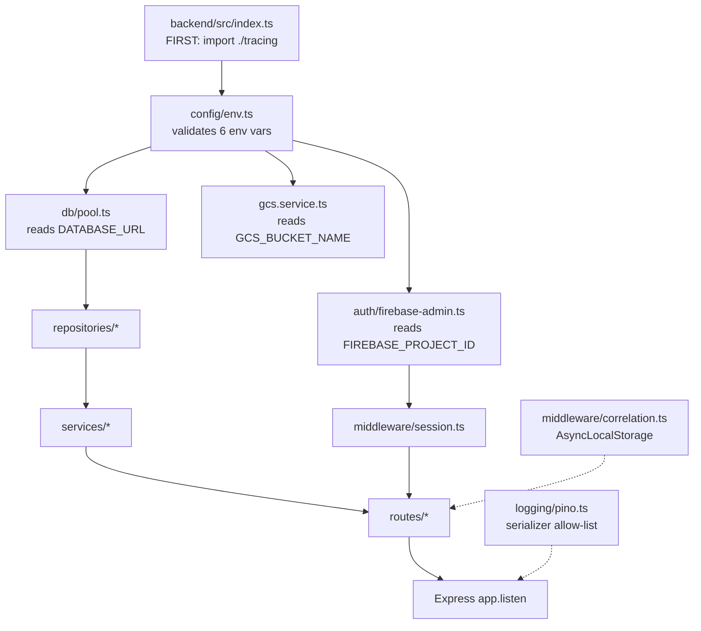
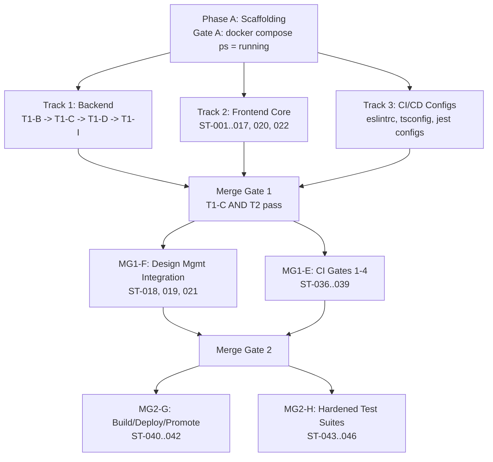

# Technical Specification

# 0. Agent Action Plan

## 0.1 Environment Setup

This sub-section catalogs the runtimes, emulators, and tooling that the Blitzy platform must provision before any track work begins. The repository baseline is documentation-only — <cite index="2-2,2-5">the repository root is a documentation- and backlog-oriented workspace rather than an application source tree</cite>, and <cite index="7-3">there is no pre-existing implementation, no legacy codebase, and no prior design documentation to reference</cite>. Every runtime, framework, package, and container below must be newly installed at the exact versions pinned by the user's prompt; no version substitutions are permitted.

### 0.1.1 Required Runtimes and Version Resolution

The user's prompt pins all runtime versions explicitly under Section 3 "Technology Specifications". These pins override any defaults or ranges suggested elsewhere in the technical specification. Version resolution for runtimes not pinned by the user follows the "highest explicitly documented supported version" rule against each ecosystem's native manifest.

| Runtime / Tool | Pinned Version | Source of Truth | Rationale |
|---|---|---|---|
| Node.js | 20 LTS | User prompt §3 "Backend runtime" | Required as the Express runtime; must be declared in `backend/package.json` `engines` field and `.nvmrc` |
| TypeScript | 5.x (strict: true throughout) | User prompt §3 "Language" | Applied to both `backend/` and `frontend/` packages |
| npm | Bundled with Node 20 LTS | Node.js distribution | Package manager for monorepo workspaces |
| PostgreSQL | 15 | User prompt §3 "Database" | Cloud SQL target; local container in `docker-compose.yml` |
| Docker Engine | Current stable with Compose V2 | Implied by user prompt §4 Gate A (`docker compose up -d`) | Required for Phase A scaffolding verification |
| Firebase Auth Emulator | Latest (via `firebase-tools`) | Implied by user prompt §4 Gate T1-C (emulator endpoints at `localhost:9099`) | Required for local auth flow testing |
| GCS Emulator (fake-gcs-server) | Latest stable | Implied by user prompt env var `GCS_EMULATOR_HOST` and LocalGCP rule | Required for local GCS upload testing |
| `gcloud` CLI | Latest stable | Implied by user prompt §4 Gate MG2-G (`gcloud run services describe`, `gcloud deploy rollouts list`) | Required for Cloud Build, Cloud Deploy, and Cloud Run interactions |

### 0.1.2 Installation Sequence

The Blitzy platform must execute installation in this order so that each tool is verified before downstream tools depend on it:

- Install Node.js 20 LTS via the non-interactive NodeSource script or `nvm install 20 --lts` followed by `nvm use 20` — verify with `node --version` reporting a `v20.x.x` string.
- Create `.nvmrc` at the repository root containing exactly `20` so that subsequent shells select the correct Node version automatically.
- Install Docker Engine with Compose V2 via the non-interactive Docker convenience script (`DEBIAN_FRONTEND=noninteractive apt-get install -y docker-ce docker-ce-cli containerd.io docker-buildx-plugin docker-compose-plugin`).
- Install `gcloud` CLI via the non-interactive apt-installable `google-cloud-cli` package.
- Bootstrap the monorepo workspaces by running `npm install` inside `backend/` and `frontend/` after their respective `package.json` files are authored in Phase A. All dependency versions are resolved from lockfiles when available, with versions pinned to exact releases as declared in §0.4 "Dependency Inventory".
- Start local infrastructure via `docker compose up -d` to bring up `backend`, `postgres`, `firebase-auth-emulator`, and `gcs-emulator` services. Verify with `docker compose ps --format json | jq -r '.[].State' | sort | uniq` returning exactly `running` — this is Gate A.

### 0.1.3 Environment Variables with No Source Defaults

All six environment variables must throw at startup when unset. The user's prompt declares under §3 "Environment variables (MUST have no defaults in source code)" — this is Rule R4 and is a non-negotiable constraint.

| Variable | Consumer | Failure Mode When Unset |
|---|---|---|
| `DATABASE_URL` | All database connections (both local TCP and Cloud SQL Unix socket paths) | Backend process exits non-zero within 2 seconds with a descriptive error |
| `FIREBASE_PROJECT_ID` | Firebase Admin SDK init | Backend process exits non-zero with a descriptive error |
| `GCS_BUCKET_NAME` | Logo upload and retrieval via `@google-cloud/storage` v7 | Backend process exits non-zero with a descriptive error |
| `GCS_EMULATOR_HOST` | Local/CI GCS emulator target | Backend process exits non-zero with a descriptive error when operating in local/CI profile |
| `COVERAGE_THRESHOLD` | Unit test gate integer threshold (0–100) | Jest unit test invocation fails during threshold evaluation |
| `GCP_REGION` | Cloud Deploy CLI commands and Cloud Run deployment | CI/CD deploy stage fails with descriptive error |

The `.env.example` file authored in Phase A must list every one of these six variables with documentation-only placeholder values (`# required` comment, never a fallback value). The backend entry point must read these via a fail-closed module (for example, `backend/src/config/env.ts`) that calls a helper such as `requireEnv('DATABASE_URL')` which throws a descriptive `Error` when the variable is absent.

### 0.1.4 Setup, Infrastructure, and Build-Time Configuration Issues

The Blitzy platform has evaluated the target environment and documents the following configuration notes for downstream awareness:

- The repository baseline provides no `package.json`, no `tsconfig.json`, no `docker-compose.yml`, no `.env.example`, and no source code — every scaffolding artifact listed in Phase A must be authored from scratch.
- The monorepo layout (per user prompt §3): `backend/`, `frontend/`, `cloudbuild.yaml`, `skaffold.yaml`, `delivery-pipeline/`, `docker-compose.yml`, `.env.example` — none of these exist yet and must be created during Phase A.
- The user's prompt specifies Node.js 20 LTS, but current ambient Node installations may be newer — the Blitzy platform must explicitly pin to 20 LTS via `.nvmrc` and `backend/package.json` `engines` to prevent silent version drift.
- The LocalGCP implementation rule (user-provided) mandates that every GCP service interaction be verifiable against emulators with zero live GCP credentials — this constrains `docker-compose.yml` to include both `firebase-auth-emulator` and `gcs-emulator` services, and constrains integration tests to create and clean up their own resources rather than depending on pre-existing emulator state.
- The CI/CD runner (Cloud Build) will need the same Docker daemon, PostgreSQL 15, Firebase Auth emulator, and GCS emulator profiles reproduced in-build so that lint/type-check/unit/integration gates run against identical infrastructure to the developer workstation.


## 0.2 Intent Clarification

This sub-section restates the user's requirements in precise technical language, surfaces implicit requirements, and maps each requirement to concrete implementation actions. The intent statements below represent exactly what the Blitzy platform will deliver; downstream agents must treat these statements as the authoritative interpretation of the user's prompt.

### 0.2.1 Core Feature Objective

Based on the prompt, the Blitzy platform understands that the new feature requirement is to implement all 49 stories (ST-001 through ST-049) across 12 epics (EP-001 through EP-012) of the StrikeForge 3D sports ball configurator as production-ready, tested, and deployed software — not as plans, not as scaffolding, and not as a subset. The Blitzy platform further understands that every story's acceptance criteria checkboxes in `tickets/stories/ST-NNN-*.md` are the single authoritative specification, and every one of those checkboxes must be satisfied before its enclosing track gate is declared passing.

The feature set delivers, as a cohesive product:

- A live, interactive 3D ball preview that renders a spherical ball centered in the configurator with immediate design updates, click-and-drag rotation, idle auto-rotation, and a documented interactive framerate floor (≥30 FPS sustained during drag rotation) and initial-load budget (≤2s initial sphere render). <cite index="9-2,9-3">The epic delivers the live, interactive 3D ball preview that anchors the configurator experience, with a user opening the configurator seeing a spherical ball rendered at the center of the screen, with every customization choice applied through the surrounding controls reflected on the sphere in real time</cite>.
- Panel color customization for primary, secondary, and accent colors with real-time preview synchronization, visible selected-swatch state, and accessibility across mouse, touch, keyboard, and assistive technology (ST-006 through ST-009).
- Stitching pattern selection and material finish selection with preview transitions and disabled-state tooltips for unsupported combinations (ST-010 through ST-013).
- Branding and logo customization including upload, immediate preview placement, interactive repositioning and resizing, and rejection of unsupported or oversized files (ST-014 through ST-017).
- Design management features: save design, load design, start a new design with confirmation, shareable links with time-limited expiry, and a live design summary sidebar (ST-018 through ST-022).
- Backend user authentication and sessions delivered via registration, login/session-token issuance, logout/session revocation, and session validation middleware (ST-023 through ST-026).
- Backend design persistence API: create design, retrieve designs by user (paginated, max 100 per page), and time-limited share-link issuance (ST-027 through ST-029).
- Backend cart and order flow: retrieve cart, create order from cart contents, and order finalization post-processing — explicitly excluding any payment processing, charge authorization, tokenization, or refund logic (ST-032 through ST-034).
- Database foundation: three forward-and-reverse PostgreSQL migrations introducing `users` + `sessions`, `designs`, and `orders` + `order_items` tables with ownership foreign keys and indexes supporting documented query patterns (ST-030, ST-031, ST-035).
- CI/CD pipeline: a seven-step Cloud Build delivery pipeline — lint → type-check → unit tests → integration tests → build → deploy → environment promotion across development/staging/production with recorded human approval identifiers (ST-036 through ST-042).
- Test coverage: unit (Jest), integration (Jest with dockerized dependencies), end-to-end (Playwright Chromium + WebKit exercising register → login → create design → save → share → add-to-cart → create order), and visual regression (Playwright `toHaveScreenshot()` with baselines committed to `visual-baselines/`) (ST-043 through ST-046).
- Observability foundation: structured JSON logging via pino with correlation ID propagation, `/metrics` (Prometheus text format with `service`, `environment`, `version` labels), `/healthz` liveness, `/readyz` readiness (503 when DB unreachable), distributed tracing via `@opentelemetry/sdk-node` with `@opentelemetry/auto-instrumentations-node`, W3C `traceparent` header propagation, and a dashboard template stub at `docs/observability/dashboard-template.md` with all 8 panels (request rate, error rate, P95 latency, error breakout, correlation throughput, active sessions, order creation rate, deploy markers) including thresholds, alert policies, and SLO tie-ins (ST-047 through ST-049).

Implicit requirements the Blitzy platform has surfaced from the prompt:

- **Monorepo package management.** The user's monorepo layout (`backend/` + `frontend/` + root-level `cloudbuild.yaml`, `skaffold.yaml`, `delivery-pipeline/`, `docker-compose.yml`, `.env.example`) implies a top-level `package.json` with workspaces, separate `tsconfig.json` configurations per workspace, and a shared root `.eslintrc.json` that each workspace extends.
- **Firebase user mirroring in PostgreSQL.** ST-031 requires a `users` table with a credential-digest column but the user's prompt mandates Firebase Admin SDK `verifyIdToken` for authentication. The implicit resolution is that the local `users` table stores the Firebase `uid` as the server-assigned identifier along with login-identifier and timestamp columns, and the "credential digest" column is retained at a minimum safe size per ST-031-AC4 but is never populated because credentials live exclusively in Firebase — this preserves ST-031's schema shape while honoring the Firebase-only validation mandate (Rule R3).
- **Session persistence semantics.** ST-024, ST-025, ST-026 reference "session tokens" but the user's Firebase-Admin-SDK-only constraint means sessions are tracked by Firebase `idToken` on inbound requests. The `sessions` table becomes a revocation-list and issuance-audit log: a session row is created on login with the `uid`, issued timestamp, expiration timestamp, and a revocation marker; logout marks the row revoked; session validation cross-references the `verifyIdToken` result against the revocation marker.
- **Share-link read-side access.** ST-029 requires that visiting a share link returns enough data for the configurator to render the target design without signing in — this implies a separate unauthenticated GET endpoint (e.g., `/api/share/:token`) that joins the `share_links` store with the underlying `designs` record, and ST-021 (share clipboard UX) copies this full URL to the clipboard.
- **Correlation ID on every outbound HTTP call.** C5 mandates that the correlation ID be attached to every outbound HTTP header, not just the inbound request — this applies to Firebase Admin SDK HTTP calls, GCS SDK HTTP calls, and any internal-service HTTP calls. Implementation requires a pino log plumbing layer combined with HTTP-client request interceptors reading from `AsyncLocalStorage`.
- **Dashboard template is a Markdown artifact, not a live dashboard.** ST-049-AC5 calls for a "dashboard template stub" delivered as a versioned artifact at `/docs/observability/dashboard-template.md`. The Blitzy platform understands this is a technology-neutral documentation file, not a Grafana/Cloud Monitoring JSON file. The file must enumerate all 8 panels, their query descriptions, thresholds, and alert policies.

### 0.2.2 Special Instructions and Constraints

The user prompt embeds six critical implementation constraints (C1–C6) and ten rules (R1–R10) that are named failure points. Each one is restated here in precise technical language with its file-level implication. These are non-negotiable and must be enforced exactly as specified.

**C1 — GCS v7 signed URL syntax (Rule R5 also applies).** Every call site in `backend/src/**/*.ts` that invokes `bucket.file(name).getSignedUrl` MUST pass an options object containing `version: 'v4', action: 'read', expires: Date.now() + 15 * 60 * 1000`. The v7 SDK removed `getSignedUrl` from `File` instances without explicit `version`; omitting the `version` key throws at runtime. Verification: `grep -rn "getSignedUrl" backend/src` must show `version: 'v4'` alongside every occurrence.

**C2 — Firebase Admin token verification (Rule R3 also applies).** The authentication middleware MUST extract the `rawBearerToken` from the `Authorization: Bearer <token>` header and call `admin.auth().verifyIdToken(rawBearerToken)` exclusively. No custom JWT parsing, signature verification, expiry checking, or JWKS fetching is permitted. Verification: `backend/package.json` must not include `jsonwebtoken`, `jose`, or `jwt-decode`.

**C3 — Cloud SQL connection dual-path.** The database connection module in `backend/src/db/` MUST construct a connection configuration entirely from `DATABASE_URL`. When running on Cloud Run, the URL form uses Unix socket host `/cloudsql/<PROJECT>:<REGION>:<INSTANCE>`. When running locally or in CI, the URL form uses TCP host `127.0.0.1` on port `5432`. There must be zero hard-coded host paths in connection logic — both paths are encoded only in `DATABASE_URL`.

**C4 — OpenTelemetry auto-instrumentation registration order (Rule R6 also applies).** The file `backend/src/tracing.ts` (or equivalent OTel bootstrap file) MUST register `@opentelemetry/auto-instrumentations-node` before any application `import`/`require` statements. The backend entry point (`backend/src/index.ts`) MUST import the tracing module as its first line. This is required because auto-instrumentation monkey-patches `pg`, `http`, and `express`, and any application import before registration produces duplicate spans or no spans at all.

**C5 — Correlation ID propagation.** A middleware at the request boundary MUST generate a UUID v4 as the correlation ID when the inbound `x-correlation-id` header is absent, and preserve it verbatim when present. The correlation ID MUST be stored in Node's `AsyncLocalStorage` (from `node:async_hooks`). A pino hook MUST attach the correlation ID to every log record emitted during the request lifecycle. Every outbound HTTP client call MUST attach the correlation ID to its outbound headers. Log records MUST contain only `correlationId` and `uid` as identity fields — passwords, bearer tokens, session tokens, and API keys MUST NEVER appear in any log record, enforced by a pino serializer allow-list (Rule R2) rather than ad-hoc per-call discipline.

**C6 — R3F + Fabric.js texture update order (Rule R7 also applies).** When a configurator selection changes, the sequence MUST be: (1) call `fabricCanvas.renderAll()`, then (2) only after `renderAll` completes, set `threeTexture.needsUpdate = true`. Reversing this order produces a one-frame stale texture that is visible as flicker in Playwright visual-regression baselines. The texture update coordinator lives in `frontend/src/configurator/texture/` and must be the single code path that mutates `threeTexture.needsUpdate`.

Documented architectural requirements:

- **Every story's acceptance criteria are authoritative (Rule R1).** The Blitzy platform MUST read and satisfy every checkbox in `tickets/stories/ST-NNN-*.md` before declaring a story's track gate passing. The epic overviews and the prompt's phase descriptions are orientation only; they do NOT replace the per-story acceptance criteria.
- **Gates fail closed (Rule R8).** Any infrastructure or tooling error in a CI gate (lint, type-check, unit, integration, build, deploy) MUST produce a failed verdict. A tooling crash is a failed run, never a silent pass.
- **Payment processing is excluded (Rule R9).** No payment processor integration, charge authorization, tokenization, or refund logic of any kind may appear in `backend/src`. Order finalization (ST-034) transitions to a documented non-terminal finalized state without any financial settlement.
- **Migrations embed story ID (Rule R10).** Every file in `backend/migrations/` MUST match the pattern `{timestamp}_ST-0NN_{description}.js`.
- **Parallel delivery structure.** Phase A is the prerequisite for all work. After Gate A passes, three tracks run concurrently: Track 1 (backend), Track 2 (frontend core), and Track 3 (CI/CD config authoring). Merge Gate 1 unlocks when Track 1 Gate C and Track 2 gate both pass. Merge Gate 2 unlocks when Merge Gate 1 passes. Within each track, each step MUST pass before the next step in that track begins.

User-Provided Rules (from the "User specified implementation rules" input):

- **Observability Rule.** "The application is not complete until it is observable." Every deliverable MUST include: structured logging with correlation IDs, distributed tracing across service boundaries, a metrics endpoint, health/readiness checks, and a dashboard template — all verifiable in the local development environment.
- **Explainability Rule.** Every non-trivial implementation decision MUST be documented in a Markdown decision-log table at `docs/decisions/README.md` with columns "Decision | Alternatives | Rationale | Risks". Any deviation from a literal interpretation of the requirements MUST have an explicit entry in the decision log. Rationale must NOT be embedded in code comments — the decision log is the single source of truth for "why".
- **Executive Presentation Rule.** Every deliverable MUST include an executive summary as a single self-contained reveal.js HTML file at `docs/executive-summary.html`, covering: what was done, why, architectural changes, risks and mitigations, and team onboarding. 12–18 slides (target 16), with slide types Title (`slide-title`), Section Divider (`slide-divider`), Content (default), Closing (`slide-closing`). Every slide must include at least one non-text visual element (Mermaid diagram, KPI card, styled table, or Lucide SVG icon via `<i data-lucide="icon-name"></i>`). Zero emoji. No fenced code blocks inside slides. Blitzy brand colors and typography (Inter body, Space Grotesk display, Fira Code mono) pinned; reveal.js 5.1.0, Mermaid 11.4.0, Lucide 0.460.0 via CDN.
- **LocalGCP Verification Rule.** Every GCP service interaction MUST be verifiable against LocalGCP (Firebase Auth emulator + fake-gcs-server) with zero live GCP dependencies in tests or local dev workflows. Integration tests MUST create their own resources during setup and clean up after teardown.
- **Segmented PR Review Rule.** Code changes MUST pass a sequential, multi-phase pre-approval review before a Pull Request can be opened. When triggered, generate a `CODE_REVIEW.md` at the repository root with YAML frontmatter tracking phase name, status (OPEN, IN_REVIEW, BLOCKED, or APPROVED), and file count per phase. Domains: Infrastructure/DevOps, Security, Backend Architecture, QA/Test Integrity, Business/Domain, Frontend, or Other SME. A Principal Reviewer Agent renders the final verdict after all domain phases reach a terminal status.

User Examples preserved verbatim from the prompt:

- **User Example (Phase A Gate A):** `docker compose up -d` then `docker compose ps --format json | jq -r '.[].State' | sort | uniq` — expected output: `running`.
- **User Example (Track 1 Gate T1-B):** `docker compose exec backend npx node-pg-migrate up` then `docker compose exec postgres psql -U postgres -d strikeforge -c "\dt" | grep -cE "users|sessions|designs|orders|order_items"` — expected: `5`.
- **User Example (Track 1 Gate T1-C, design create):** `curl -sf -X POST http://localhost:3000/api/designs -H "Authorization: Bearer $TOKEN" -H "Content-Type: application/json" -d '{"title":"Gate C","payload":{"primaryColor":"#FF0000","pattern":"classic","finish":"matte"}}' | jq '.id' | grep -v null`.
- **User Example (Gate T1-D, readiness degraded):** `docker compose stop postgres && sleep 3; curl -s -o /dev/null -w "%{http_code}" http://localhost:3000/readyz` — expected: `503`.
- **User Example (Gate T1-I, trace propagation):** `curl -s "http://localhost:3000/api/designs" -H "Authorization: Bearer $TOKEN" -H "traceparent: 00-4bf92f3577b34da6a3ce929d0e0e4736-00f067aa0ba902b7-01"` then `docker compose logs backend --tail 20 | grep -c "4bf92f3577b34da6a3ce929d0e0e4736"` — expected: `≥1`.
- **User Example (Rule R2 credential sentinel):** `curl -X POST http://localhost:3000/api/auth/login -H "Content-Type: application/json" -d '{"email":"test@example.com","password":"SENTINEL_CRED_99"}'` then `grep "SENTINEL_CRED_99" <(docker compose logs backend)` — expected: 0 lines returned.
- **User Example (Rule R4 fail-fast):** Starting backend without `DATABASE_URL` exits non-zero with a descriptive error within 2 seconds.

Web search requirements: No external research is required. All technology versions are pinned by the user's prompt (§3 "Technology Specifications"), and all package APIs (GCS v7 signed URL, Firebase Admin SDK, OTel auto-instrumentation, pino redaction, Fabric.js + R3F texture ordering) are fully specified in Sections C1–C6 of the user's prompt.

### 0.2.3 Technical Interpretation

These feature requirements translate to the following technical implementation strategy. Each requirement line below uses the format "To [implement feature], the Blitzy platform will [create/modify/extend] [specific components]."

- To satisfy EP-001 (3D Ball Preview & Interaction), the Blitzy platform will **create** `frontend/src/configurator/preview/` with `BallCanvas.tsx` (R3F `<Canvas>` root), `Sphere.tsx` (geometry + material), `useDragRotation.ts` (pointer events → quaternion), `useIdleAutoRotate.ts` (idle timer + rAF rotation), and `performance.ts` (FPS meter + Playwright performance hooks).
- To satisfy EP-002 (Panel Color Customization), the Blitzy platform will **create** `frontend/src/configurator/controls/colors/` with `PrimaryColorPicker.tsx`, `SecondaryColorPicker.tsx`, `AccentColorPicker.tsx`, and `useColorStore.ts` (Zustand or equivalent state store) that drives the texture pipeline via the C6-compliant texture coordinator.
- To satisfy EP-003 (Stitching Pattern + Finish), the Blitzy platform will **create** `frontend/src/configurator/controls/pattern/StitchingPatternSelector.tsx` (six patterns), `FinishSelector.tsx` (three finishes), and `DisabledCombinationTooltip.tsx` with disabled-state rules enforced by a combination-matrix module.
- To satisfy EP-004 (Branding & Logo), the Blitzy platform will **create** `frontend/src/configurator/controls/logo/LogoUploader.tsx` (file-picker with valid-MIME allow-list), `LogoPositioner.tsx` (Fabric.js drag-resize-rotate handles), and a `texturePipeline.ts` coordinator that rigorously follows C6 (Fabric `renderAll()` first, then Three `needsUpdate = true`).
- To satisfy EP-005 (Design Management), the Blitzy platform will **create** `frontend/src/features/design-management/` containing `SaveDesignCta.tsx`, `LoadDesignList.tsx`, `NewDesignDialog.tsx`, `ShareDesignAction.tsx`, and `DesignSummarySidebar.tsx`. Pre-Merge-Gate-1, these call a mock/stub API layer; post-Merge-Gate-1 they call the live backend endpoints.
- To satisfy EP-006 (Authentication & Sessions), the Blitzy platform will **create** `backend/src/routes/auth.ts` (registration, login, logout), `backend/src/middleware/session.ts` (Rule-R3 Firebase-Admin-SDK-only validation), and `backend/src/services/session.service.ts` (sessions table CRUD with revocation).
- To satisfy EP-007 (Design Persistence API), the Blitzy platform will **create** `backend/src/routes/designs.ts` (POST create, GET list with pagination max 100, POST share-link), `backend/src/services/design.service.ts`, `backend/src/services/share-link.service.ts`, and `backend/src/repositories/design.repository.ts` (pg connection pool queries).
- To satisfy EP-008 (Cart & Order Flow), the Blitzy platform will **create** `backend/src/routes/orders.ts` (POST create, GET cart, POST finalize), `backend/src/services/order.service.ts`, and `backend/src/repositories/order.repository.ts`. Payment processing is explicitly excluded per Rule R9.
- To satisfy EP-009 (CI/CD Pipeline), the Blitzy platform will **create** `cloudbuild.yaml` (seven steps with explicit `waitFor`), `skaffold.yaml`, and `delivery-pipeline/clouddeploy.yaml` (development → staging → production targets with recorded-approval promotion gates).
- To satisfy EP-010 (Test Suites), the Blitzy platform will **create** `backend/jest.config.unit.ts` + `backend/jest.config.integration.ts`, unit tests under `backend/src/**/*.test.ts`, integration tests under `backend/tests/integration/`, E2E tests under `frontend/tests/e2e/`, visual tests under `frontend/tests/visual/`, and visual baselines under `frontend/visual-baselines/`.
- To satisfy EP-011 (Observability), the Blitzy platform will **create** `backend/src/tracing.ts` (OTel SDK init — imported first per C4/R6), `backend/src/logging/pino.ts` (with serializer allow-list per R2), `backend/src/middleware/correlation.ts` (C5 AsyncLocalStorage), `backend/src/routes/metrics.ts` (Prometheus text format with `service`/`environment`/`version` labels), `backend/src/routes/health.ts` (`/healthz` and `/readyz`), and **update** `docs/observability/dashboard-template.md` to contain all 8 panels with thresholds and alert policies.
- To satisfy EP-012 (Database Schemas), the Blitzy platform will **create** three node-pg-migrate migration files in `backend/migrations/`, each filename embedding its story ID per Rule R10: `{timestamp}_ST-031_users_sessions.js`, `{timestamp}_ST-030_designs.js`, and `{timestamp}_ST-035_orders_order_items.js`.
- To satisfy the user-provided Executive Presentation Rule, the Blitzy platform will **replace** the existing `docs/executive-summary.html` with a 16-slide reveal.js deck covering the implementation, risks, and onboarding — preserving the existing Blitzy brand theme and slide conventions.
- To satisfy the user-provided Explainability Rule, the Blitzy platform will **update** `docs/decisions/README.md` with a decision table enumerating every non-trivial implementation choice (e.g., "why Zustand vs Redux for frontend state", "why node-pg-migrate vs Knex", "why pino vs winston").


## 0.3 Repository Scope Discovery

This sub-section enumerates every existing file and folder the Blitzy platform has inspected, every file to be created, and every integration touchpoint affected by the feature. Because <cite index="2-2">the repository root is a documentation- and backlog-oriented workspace rather than an application source tree</cite>, the scope is dominated by **new** source files; existing files are touched almost exclusively within `docs/` and `tickets/` to keep documentation in step with the shipped implementation.

### 0.3.1 Comprehensive File Analysis — Existing Files Evaluated

The following repository artifacts were retrieved, summarized, and evaluated for relevance to this feature addition.

| Path | Type | Role in Feature Addition |
|---|---|---|
| `README.md` | File | Project identity marker (contains only `# blitzy-configurator`); MODIFY to add project description, local-dev quick-start, and links to `docs/` artifacts |
| `blitzy/documentation/Project Guide.md` | File | Completion/handoff narrative for the backlog; READ-ONLY context — not modified by implementation |
| `blitzy/documentation/Technical Specifications.md` | File | Authoritative specification governing documentation production; READ-ONLY context — this Agent Action Plan becomes part of this document |
| `docs/executive-summary.html` | File | Existing reveal.js deck for the backlog package; REPLACE with a deck that summarizes the shipped implementation per the user-provided Executive Presentation Rule |
| `docs/decisions/README.md` | File | Decision log table for the backlog; MODIFY to append implementation decisions per the user-provided Explainability Rule |
| `docs/observability/README.md` | File | Observability contract catalog linking ST-047/ST-048/ST-049 to deliverables; MODIFY to document what was reused versus added in the live implementation |
| `docs/observability/dashboard-template.md` | File | Vendor-neutral dashboard blueprint; MODIFY to include all 8 panels (request rate, error rate, P95 latency, error breakout, correlation throughput, active sessions, order creation rate, deploy markers) with thresholds, alert policies, and SLO tie-ins per ST-049-AC5 |
| `tickets/epics/EP-001-*.md` through `EP-012-*.md` | 12 Files | Authoritative epic specifications; READ-ONLY — MUST be honored, never rewritten |
| `tickets/stories/ST-001-*.md` through `ST-049-*.md` | 49 Files | Authoritative story specifications with acceptance criteria checkboxes per Rule R1; READ-ONLY source of truth, each checkbox MUST be marked complete before its gate passes. Checkbox updates are permitted; rewording of the acceptance criteria is not. |
| `tickets/templates/README.md`, `epic-template.md`, `story-template.md` | 3 Files | Template scaffolds for backlog authoring; READ-ONLY — not relevant to implementation |

**Conclusion of existing-file evaluation:** The repository contains no application source code, no build manifests, no CI/CD configuration, and no infrastructure definitions. Every runtime, library, container, database, and deploy artifact is new and must be authored from scratch.

### 0.3.2 New Files to Create — Root and Scaffolding

| Path | Purpose |
|---|---|
| `package.json` | Monorepo root with `workspaces: ["backend", "frontend"]`, shared `devDependencies` (ESLint, Prettier, TypeScript) |
| `tsconfig.json` | Root TypeScript config with `strict: true`; referenced by `backend/tsconfig.json` and `frontend/tsconfig.json` |
| `.eslintrc.json` | Shared ESLint config (consumed by Track 3 and MG1-E lint gate per ST-036) |
| `.prettierrc` | Shared formatter config |
| `.nvmrc` | Contents: `20` — pins Node.js 20 LTS |
| `.gitignore` | Node, Docker, Playwright, coverage, build output exclusions |
| `.env.example` | All six required environment variables (per Rule R4) with placeholder comments — NEVER fallback values |
| `docker-compose.yml` | Services: `backend`, `postgres` (v15), `firebase-auth-emulator`, `gcs-emulator`; used for Phase A Gate A |
| `cloudbuild.yaml` | Cloud Build pipeline with seven explicit `waitFor` steps: lint, type-check, unit, integration, build, deploy, artifacts (ST-036–ST-041) |
| `skaffold.yaml` | Cloud Deploy / Skaffold orchestration reference |
| `delivery-pipeline/clouddeploy.yaml` | Cloud Deploy pipeline with `development` → `staging` → `production` targets, approval gates per ST-042 |
| `CODE_REVIEW.md` | Generated at change time per the user-provided Segmented PR Review Rule |

### 0.3.3 New Files to Create — Backend (`backend/`)

| Path | Purpose |
|---|---|
| `backend/package.json` | Express, pg, Firebase Admin, `@google-cloud/storage`, pino, OpenTelemetry, node-pg-migrate, Jest dependencies |
| `backend/tsconfig.json` | Extends root; `"strict": true`, `"target": "ES2022"`, `"module": "commonjs"` |
| `backend/Dockerfile` | Multi-stage build: `builder` (full devDeps + compile) → `production` (pruned node_modules + dist) |
| `backend/src/index.ts` | Entry point; FIRST line is `import './tracing'` per C4/R6; then env validation; then Express bootstrap |
| `backend/src/tracing.ts` | OTel SDK init with `@opentelemetry/auto-instrumentations-node` BEFORE any app imports |
| `backend/src/config/env.ts` | `requireEnv()` helper that throws on absent variable per Rule R4 |
| `backend/src/db/pool.ts` | `pg` connection pool reading `DATABASE_URL` (C3) |
| `backend/src/db/client.ts` | Query helpers with pool acquisition, release, and OTel span annotation |
| `backend/src/auth/firebase-admin.ts` | Firebase Admin initialization; `verifyIdToken` wrapper per C2/R3 |
| `backend/src/middleware/session.ts` | Session validation: extract bearer, call `verifyIdToken`, check `sessions` revocation marker, attach `uid` to request |
| `backend/src/middleware/correlation.ts` | Correlation-ID middleware per C5; AsyncLocalStorage, pino hook, outbound header propagation |
| `backend/src/logging/pino.ts` | Pino logger with redaction allow-list per Rule R2; serializer drops `password`, `Authorization`, `credential`, bearer-token-pattern fields |
| `backend/src/routes/auth.ts` | `/api/auth/register` (ST-023), `/api/auth/login` (ST-024), `/api/auth/logout` (ST-025) |
| `backend/src/routes/designs.ts` | `/api/designs` POST (ST-027), GET paginated (ST-028), `/api/designs/:id/share-link` POST (ST-029) |
| `backend/src/routes/share.ts` | `/api/share/:token` GET — unauthenticated read-only design access |
| `backend/src/routes/cart.ts` | `/api/cart` GET (ST-033) |
| `backend/src/routes/orders.ts` | `/api/orders` POST (ST-032), `/api/orders/:id/finalize` POST (ST-034) |
| `backend/src/routes/metrics.ts` | `/metrics` Prometheus text format: `http_requests_total` counter, `http_request_duration_seconds` histogram, `process_up` gauge with `service`/`environment`/`version` labels (ST-048) |
| `backend/src/routes/health.ts` | `/healthz` (liveness) and `/readyz` (readiness; 503 when DB unreachable) (ST-048) |
| `backend/src/services/session.service.ts` | Session issuance + revocation (ST-024, ST-025) |
| `backend/src/services/design.service.ts` | Create/list/share-link orchestration |
| `backend/src/services/share-link.service.ts` | Time-limited share token generation + validation (ST-029) |
| `backend/src/services/order.service.ts` | Cart retrieval, order creation, finalization post-processing (ST-032–ST-034) |
| `backend/src/services/gcs.service.ts` | `@google-cloud/storage` v7 wrapper; ALL `getSignedUrl` calls pass `version: 'v4'` per C1/R5 |
| `backend/src/repositories/user.repository.ts` | CRUD for `users` table |
| `backend/src/repositories/session.repository.ts` | CRUD for `sessions` table |
| `backend/src/repositories/design.repository.ts` | CRUD for `designs` table with pagination (max 100 per ST-028) |
| `backend/src/repositories/order.repository.ts` | CRUD for `orders` and `order_items` tables |
| `backend/src/repositories/share-link.repository.ts` | CRUD for share-link persistence |
| `backend/migrations/{ts}_ST-031_users_sessions.js` | Forward + reverse migration introducing `users` and `sessions` tables per ST-031 |
| `backend/migrations/{ts}_ST-030_designs.js` | Forward + reverse migration introducing `designs` table per ST-030 |
| `backend/migrations/{ts}_ST-035_orders_order_items.js` | Forward + reverse migration introducing `orders` and `order_items` tables per ST-035 |
| `backend/jest.config.unit.ts` | Jest config with coverage threshold from `COVERAGE_THRESHOLD` env var; authored in Track 3 |
| `backend/jest.config.integration.ts` | Jest config for service-boundary tests; authored in Track 3 |
| `backend/src/**/*.test.ts` | Co-located unit tests per ST-043 |
| `backend/tests/integration/**/*.test.ts` | Service-boundary integration tests per ST-044 |

### 0.3.4 New Files to Create — Frontend (`frontend/`)

| Path | Purpose |
|---|---|
| `frontend/package.json` | React 18, Vite, @react-three/fiber, @react-three/drei, Three.js, Fabric.js 6.x, Playwright |
| `frontend/tsconfig.json` | Extends root; `"jsx": "react-jsx"`, `"strict": true` |
| `frontend/vite.config.ts` | Vite dev server + build config |
| `frontend/index.html` | Vite entry HTML |
| `frontend/Dockerfile` | Multi-stage build: `builder` (Vite build) → `production` (nginx + static dist) |
| `frontend/src/main.tsx` | React 18 `createRoot` bootstrap |
| `frontend/src/App.tsx` | Top-level layout: preview + control sidebar + summary sidebar |
| `frontend/src/configurator/preview/BallCanvas.tsx` | R3F `<Canvas>` root (ST-001) |
| `frontend/src/configurator/preview/Sphere.tsx` | Sphere geometry + material with texture slot |
| `frontend/src/configurator/preview/useDragRotation.ts` | Click-and-drag rotation (ST-002) |
| `frontend/src/configurator/preview/useIdleAutoRotate.ts` | Idle auto-rotation (ST-003) |
| `frontend/src/configurator/preview/performance.ts` | FPS meter + initial-load timer (ST-005) |
| `frontend/src/configurator/controls/colors/PrimaryColorPicker.tsx` | ST-006 |
| `frontend/src/configurator/controls/colors/SecondaryColorPicker.tsx` | ST-007 |
| `frontend/src/configurator/controls/colors/AccentColorPicker.tsx` | ST-008 |
| `frontend/src/configurator/controls/colors/useColorSync.ts` | Real-time preview sync (ST-009) |
| `frontend/src/configurator/controls/pattern/StitchingPatternSelector.tsx` | Six patterns (ST-010) |
| `frontend/src/configurator/controls/pattern/FinishSelector.tsx` | Three finishes (ST-011) |
| `frontend/src/configurator/controls/pattern/TransitionFeedback.tsx` | Visual transition feedback (ST-012) |
| `frontend/src/configurator/controls/pattern/DisabledCombinationTooltip.tsx` | Incompatible-combination tooltip (ST-013) |
| `frontend/src/configurator/controls/logo/LogoUploader.tsx` | File-picker (ST-014) |
| `frontend/src/configurator/controls/logo/LogoPositioner.tsx` | Fabric.js drag-resize handles (ST-015, ST-016) |
| `frontend/src/configurator/controls/logo/InvalidFileFeedback.tsx` | Rejection messages (ST-017) |
| `frontend/src/configurator/texture/texturePipeline.ts` | Fabric-first-then-Three coordinator per C6/R7 |
| `frontend/src/configurator/texture/fabricCanvas.ts` | Fabric.js canvas singleton |
| `frontend/src/configurator/texture/threeTexture.ts` | Three.js texture wrapping the Fabric canvas |
| `frontend/src/features/design-management/SaveDesignCta.tsx` | ST-018 |
| `frontend/src/features/design-management/LoadDesignList.tsx` | ST-019 |
| `frontend/src/features/design-management/NewDesignDialog.tsx` | ST-020 |
| `frontend/src/features/design-management/ShareDesignAction.tsx` | ST-021 |
| `frontend/src/features/design-management/DesignSummarySidebar.tsx` | ST-022 |
| `frontend/src/api/client.ts` | Fetch wrapper attaching Firebase `idToken` Bearer + `x-correlation-id` |
| `frontend/src/api/designs.ts` | Design API calls — stubbed during Track 2, wired to live backend during MG1-F |
| `frontend/src/api/orders.ts` | Cart + order API calls |
| `frontend/src/auth/firebase-client.ts` | Firebase client SDK init, `getIdToken()` helper |
| `frontend/src/state/configuratorStore.ts` | Zustand (or equivalent) store holding design selections |
| `frontend/playwright.config.ts` | Playwright projects `chromium` + `webkit`, visual-snapshots mode |
| `frontend/tests/configurator/*.spec.ts` | Configurator smoke + interaction tests (Gate T2) |
| `frontend/tests/performance/*.spec.ts` | FPS ≥30 and initial load ≤2000 ms assertions (Gate T2) |
| `frontend/tests/e2e/*.spec.ts` | Critical flows register → login → create → save → share → cart → order (ST-045) |
| `frontend/tests/visual/*.spec.ts` | `toHaveScreenshot()` visual regression (ST-046) |
| `frontend/visual-baselines/**/*.png` | Baseline PNGs committed to repo (ST-046) |

### 0.3.5 Integration Point Discovery

The following integration points connect the feature set internally and externally.

| Integration Point | Where | Direction |
|---|---|---|
| Firebase Auth Emulator (local) / Firebase Auth (prod) | `backend/src/auth/firebase-admin.ts`, `frontend/src/auth/firebase-client.ts` | Outbound |
| PostgreSQL (Cloud SQL via Unix socket in prod; TCP in local/CI per C3) | `backend/src/db/pool.ts` | Outbound |
| GCS (fake-gcs-server locally; real GCS in prod) | `backend/src/services/gcs.service.ts` | Outbound |
| Cloud Run | Deployed via Cloud Deploy from `cloudbuild.yaml` | Ingress for backend service |
| Cloud Build | Authored in `cloudbuild.yaml`; triggered by pull requests per ST-036–ST-042 | CI runner |
| Cloud Deploy | Authored in `delivery-pipeline/clouddeploy.yaml`; dev → staging → prod | Deployment orchestrator |
| `/metrics` endpoint (Prometheus scraper) | `backend/src/routes/metrics.ts` | Inbound scrape |
| `/healthz`, `/readyz` probes (Cloud Run platform, local orchestrator) | `backend/src/routes/health.ts` | Inbound health check |
| W3C `traceparent` header | `backend/src/tracing.ts` auto-instrumentation; propagated via `http` client | Bidirectional |
| Correlation-ID `x-correlation-id` header | `backend/src/middleware/correlation.ts` | Bidirectional (preserve in, attach out) |

### 0.3.6 Web Search Research Conducted

No external web search is required. The user's prompt pins every package at a specific major version and names every critical API (GCS v7 `getSignedUrl({ version: 'v4', ... })`, Firebase Admin `verifyIdToken`, OTel auto-instrumentation registration order, pino serializer allow-list, Fabric `renderAll()` → Three `needsUpdate`). Downstream agents implementing this action plan should rely on the prompt's named symbols verbatim rather than searching for alternative APIs.

### 0.3.7 Files Ignored by `.blitzyignore`

The repository contains **no `.blitzyignore` files** at any level (verified by `find . -name ".blitzyignore"` returning zero results). All paths in the repository are available for inspection, modification, and creation subject to the rules declared elsewhere in this Agent Action Plan.


## 0.4 Dependency Inventory

This sub-section enumerates every public and private package that the feature addition depends on. All versions are pinned exactly as the user's prompt declares; no version is invented, loosened, or substituted.

### 0.4.1 Backend Dependencies (`backend/package.json`)

| Package | Version | Registry | Purpose |
|---|---|---|---|
| `typescript` | 5.x (strict) | npm | Language (user prompt §3 pin) |
| `@types/node` | 20.x | npm | Node 20 LTS type definitions |
| `express` | 4.x | npm | HTTP framework (user prompt §3 pin) |
| `@types/express` | 4.x | npm | Express type definitions |
| `pg` | ^8.x | npm | PostgreSQL client with connection pool (user prompt §3 "Database client") |
| `@types/pg` | ^8.x | npm | `pg` type definitions |
| `node-pg-migrate` | ^6.x | npm | Migration tool (user prompt §3 "Migration tool") |
| `firebase-admin` | ^12.x | npm | Firebase Admin SDK for `verifyIdToken` (user prompt §3 "Authentication"); Rule R3 forbids any JWT library substitute |
| `@google-cloud/storage` | ^7.x | npm | GCS client; Rule R5 requires `version: 'v4'` on every `getSignedUrl` call |
| `pino` | ^8.x | npm | Structured JSON logging (user prompt §3 "Observability") |
| `pino-http` | ^8.x | npm | Pino Express middleware |
| `@opentelemetry/sdk-node` | ^0.50.x | npm | OTel SDK (user prompt §3 "Observability") |
| `@opentelemetry/auto-instrumentations-node` | ^0.47.x | npm | Auto-instrumentation; Rule R6 requires registration before any application import |
| `@opentelemetry/api` | ^1.x | npm | OTel public API |
| `uuid` | ^9.x | npm | UUID v4 for correlation IDs (C5) |
| `prom-client` | ^15.x | npm | Prometheus text-format metrics for `/metrics` (ST-048) |
| `zod` | ^3.x | npm | Runtime schema validation for request bodies |
| `dotenv` | ^16.x | npm | Local `.env` loading in dev only — Rule R4 still enforces throw-on-missing |

**DevDependencies (backend):**

| Package | Version | Purpose |
|---|---|---|
| `jest` | ^29.x | Unit + integration test runner |
| `ts-jest` | ^29.x | Jest TypeScript transformer |
| `@types/jest` | ^29.x | Jest type definitions |
| `supertest` | ^6.x | HTTP-level integration testing |
| `eslint` | ^8.x | Static analysis for lint gate (ST-036) |
| `@typescript-eslint/parser` | ^6.x | ESLint parser |
| `@typescript-eslint/eslint-plugin` | ^6.x | TypeScript ESLint rules |
| `prettier` | ^3.x | Formatter |

**Forbidden packages (Rule R3):** `jsonwebtoken`, `jose`, `jwt-decode` — verification: these strings MUST NOT appear in `backend/package.json`.

**Forbidden packages (Rule R9):** `stripe`, `braintree`, `paypal`, `payment_intent`, `charge` — verification: `grep -ri "stripe\|braintree\|paypal\|payment_intent\|charge" backend/src` returns zero matches.

### 0.4.2 Frontend Dependencies (`frontend/package.json`)

| Package | Version | Registry | Purpose |
|---|---|---|---|
| `typescript` | 5.x (strict) | npm | Language |
| `react` | ^18.x | npm | UI framework (user prompt §3 "Frontend") |
| `react-dom` | ^18.x | npm | React DOM renderer |
| `vite` | ^5.x | npm | Build tool + dev server (user prompt §3 "Frontend") |
| `@vitejs/plugin-react` | ^4.x | npm | React plugin for Vite |
| `@react-three/fiber` | ^8.x | npm | R3F React binding to Three.js (user prompt §3 "3D rendering") |
| `@react-three/drei` | ^9.x | npm | R3F helpers (OrbitControls, PerspectiveCamera) |
| `three` | ^0.160.x | npm | Three.js core (pinned via drei/fiber compatibility) |
| `@types/three` | ^0.160.x | npm | Three.js type definitions |
| `fabric` | ^6.x | npm | Fabric.js canvas library for texture layer (user prompt §3 "Canvas texture") |
| `firebase` | ^10.x | npm | Firebase client SDK (for obtaining `idToken` on the browser) |
| `zustand` | ^4.x | npm | Lightweight state store for configurator selections |

**DevDependencies (frontend):**

| Package | Version | Purpose |
|---|---|---|
| `@playwright/test` | ^1.44.x | E2E + visual regression runner (user prompt §3 "E2E / visual") |
| `@types/react` | ^18.x | React type definitions |
| `@types/react-dom` | ^18.x | React DOM type definitions |
| `eslint` | ^8.x | Shared with backend via root `.eslintrc.json` |
| `eslint-plugin-react` | ^7.x | React lint rules |
| `eslint-plugin-react-hooks` | ^4.x | React-hooks lint rules |

### 0.4.3 Root Monorepo Dependencies (`package.json`)

| Package | Version | Purpose |
|---|---|---|
| `typescript` | 5.x | Hoisted for workspace sharing |
| `eslint` | ^8.x | Hoisted for lint gate |
| `prettier` | ^3.x | Hoisted for formatting |
| `npm-run-all` | ^4.x | Orchestrates `backend` + `frontend` scripts |

### 0.4.4 Container and Infrastructure Dependencies

| Image / Binary | Version | Purpose |
|---|---|---|
| `postgres` Docker image | `15-alpine` | Local PostgreSQL in `docker-compose.yml` (user prompt §3 "Database") |
| `node` Docker image | `20-alpine` | Base for `backend/Dockerfile` multi-stage (user prompt §3 "Backend runtime") |
| `nginx` Docker image | `1.27-alpine` | Base for `frontend/Dockerfile` production stage serving Vite `dist/` |
| Firebase Auth Emulator | Latest from `firebase-tools` container | Local auth emulator (Gate T1-C) |
| `fsouza/fake-gcs-server` | `latest` | Local GCS emulator (LocalGCP Rule) |
| `gcloud` CLI | Latest stable | Cloud Deploy + Cloud Run describe commands (Gate MG2-G) |
| Cloud Build | SaaS | CI runner for seven-step pipeline (EP-009) |
| Cloud Deploy | SaaS | Promotion orchestrator (ST-042) |
| Cloud Run | SaaS | Target runtime for backend service |
| Cloud SQL for PostgreSQL | Version 15 | Production database |
| Google Cloud Storage | SaaS | Production logo storage bucket |

### 0.4.5 Executive Presentation CDN Dependencies (`docs/executive-summary.html`)

Per the user-provided Executive Presentation Rule, the reveal.js deck pins CDN versions exactly:

| Asset | Version | CDN |
|---|---|---|
| reveal.js | 5.1.0 | CDN (script + CSS) |
| Mermaid | 11.4.0 | CDN |
| Lucide | 0.460.0 | CDN |
| Google Fonts | N/A | `<link>` for Inter, Space Grotesk, Fira Code |

### 0.4.6 Import Update Rules

Because this is greenfield implementation, there are no pre-existing imports to transform. All imports are new. Import conventions across the backend and frontend workspaces:

- **Absolute paths within a workspace.** `backend/src/routes/designs.ts` imports repositories as `from './../repositories/design.repository'` — consistent relative notation.
- **No barrel files in hot paths.** The frontend `frontend/src/configurator/**` modules MUST NOT use aggregated `index.ts` barrel exports for Three.js / Fabric.js modules because those interfere with Vite tree-shaking and produce measurable bundle-size regressions.
- **OTel tracing import MUST be first.** Every backend entry point (`backend/src/index.ts` and any Jest integration test bootstrap) MUST place `import './tracing'` as the first line of the file per Rule R6.

### 0.4.7 External Reference Updates

| File | Update Category | Purpose |
|---|---|---|
| `README.md` | Documentation | Add local-dev quick-start, link to `docs/executive-summary.html`, link to `docs/decisions/README.md`, link to `docs/observability/README.md` |
| `.env.example` | Configuration | Enumerate all six required environment variables with documentation-only comments |
| `docker-compose.yml` | Infrastructure | Declare `backend`, `postgres`, `firebase-auth-emulator`, `gcs-emulator` services |
| `cloudbuild.yaml` | CI/CD | Seven-step pipeline with explicit `waitFor` directives per ST-036–ST-041 |
| `skaffold.yaml` | CI/CD | Skaffold profile referenced by Cloud Deploy |
| `delivery-pipeline/clouddeploy.yaml` | CI/CD | Development → Staging → Production targets with approval gating per ST-042 |
| `docs/observability/dashboard-template.md` | Documentation | All 8 panels with thresholds and alert policies per ST-049-AC5 |
| `docs/decisions/README.md` | Documentation | Decision log additions per user-provided Explainability Rule |
| `docs/observability/README.md` | Documentation | Note what was reused vs added during implementation |
| `docs/executive-summary.html` | Documentation | Replace with 16-slide implementation-summary deck per user-provided Executive Presentation Rule |


## 0.5 Integration Analysis

This sub-section documents every integration touchpoint, dependency injection site, and schema change that the feature addition introduces into the greenfield baseline. Because the repository starts with only documentation and backlog artifacts, most "integration points" are new wiring between newly authored modules rather than modifications of pre-existing code — but the wiring must be described with the same precision as any code-touch plan to eliminate ambiguity for downstream agents.

### 0.5.1 Existing Code Touchpoints

Although no runtime code exists in the baseline, the feature addition updates the following existing documentation files in-place so that the shipped implementation's narrative stays synchronized with the backlog's narrative:

| File | Modification Intent |
|---|---|
| `README.md` | Expand from identity marker to a local-dev quick-start: `nvm use`, `npm install`, `docker compose up -d`, `npx node-pg-migrate up`, links to `docs/`. |
| `docs/observability/dashboard-template.md` | Add the complete 8-panel catalog (request rate, error rate, P95 latency, error breakout, correlation throughput, active sessions, order creation rate, deploy markers) with thresholds, alert policies, and SLO tie-ins per ST-049-AC5. |
| `docs/observability/README.md` | Populate "What Was Reused" and "What Was Added" sections with the live implementation's observability posture. |
| `docs/decisions/README.md` | Append a decision row per non-trivial implementation choice (state library, migration tool, logging lib, etc.) per the user-provided Explainability Rule. |
| `docs/executive-summary.html` | Replace current backlog deck with a 16-slide implementation-summary deck per the user-provided Executive Presentation Rule. |

No existing epic or story Markdown file is **rewritten**; only the acceptance-criteria checkboxes in each `tickets/stories/ST-NNN-*.md` are marked complete (per Rule R1) once the corresponding gate passes.

### 0.5.2 Dependency Injections — Newly Introduced Wiring

Because all source code is new, "dependency injections" refer to the wiring of newly authored modules through a lightweight composition-root pattern. No heavy DI container (e.g., InversifyJS) is used; instead, the Express app's composition root assembles services explicitly.

| Location | Wiring Intent |
|---|---|
| `backend/src/index.ts` | First line imports `./tracing` (C4/R6); then reads env via `config/env.ts`; then initializes `db/pool.ts`, `auth/firebase-admin.ts`, `logging/pino.ts`; then mounts middleware `correlation.ts` → `session.ts` → routes. |
| `backend/src/routes/*.ts` | Each route file exports a factory that receives its required services (e.g., `createDesignRoutes(designService)`); the factory returns an `express.Router`. |
| `backend/src/middleware/session.ts` | Depends on `auth/firebase-admin.ts` (`verifyIdToken`) and `repositories/session.repository.ts` (revocation lookup). Applied globally to every path under `/api/*` EXCEPT `/api/auth/register` and `/api/auth/login` (explicit exclusion list per ST-026 and user prompt §4 Track 1 T1-C). |
| `backend/src/middleware/correlation.ts` | First middleware in the chain. Reads `x-correlation-id` header, generates UUID v4 if absent, stores in `AsyncLocalStorage`, attaches to pino log context, and registers outbound `http` client interceptor for header propagation. |
| `frontend/src/App.tsx` | Composes `BallCanvas` + control sidebars + summary sidebar; mounts `firebase-client.ts` once at startup; provides `configuratorStore` via Zustand. |
| `frontend/src/api/client.ts` | Every outbound API call attaches `Authorization: Bearer ${await getIdToken()}` and `x-correlation-id: ${uuid()}`. |

The composition sequence is diagrammed below.



### 0.5.3 Database and Schema Updates

Three forward-and-reverse migrations introduce the complete PostgreSQL schema. Migrations MUST be applied in the following dependency order per user prompt §4 Track 1 T1-B: ST-031 → ST-030 → ST-035. Every filename embeds its story ID per Rule R10.

| Migration File | Tables Introduced | Key Columns and Constraints | Indexes | Consumed By |
|---|---|---|---|---|
| `backend/migrations/{ts}_ST-031_users_sessions.js` | `users`, `sessions` | `users` (id PK, login identifier UNIQUE, credential digest sized to prevent cleartext storage per ST-031-AC4, created timestamp); `sessions` (token ref, user FK, issued timestamp, expires timestamp, revocation marker) | `users` UNIQUE on login identifier; `sessions` UNIQUE on token ref; `sessions` secondary index on user FK | ST-023–ST-026 (auth endpoints), ST-027 (ownership FK) |
| `backend/migrations/{ts}_ST-030_designs.js` | `designs` | server-assigned id PK, user FK → `users`, title, JSON payload (colors + pattern + finish + logo reference + placement), created timestamp, last-modified timestamp | Index on `(user_id, last_modified_at DESC)` for list-by-owner queries; index on `id` (PK implicit) | ST-027 (create), ST-028 (list), ST-029 (share link) |
| `backend/migrations/{ts}_ST-035_orders_order_items.js` | `orders`, `order_items` | `orders` (id PK, user FK → `users`, state enum, subtotal, created/last-modified timestamps); `order_items` (order FK → `orders`, design FK → `designs`, quantity, per-item metadata) | `orders` index on `(user_id, state)`; `order_items` index on `order_id` | ST-032 (create order), ST-033 (retrieve cart), ST-034 (finalize) |

Every reverse migration drops tables in correct foreign-key dependency order: `order_items` before `orders`; `sessions` before `users`. Both directions are idempotent against repeat application on a clean state per ST-030-AC3, ST-031-AC3, and ST-035-AC4.

### 0.5.4 External Service Integrations

| External Service | Local Emulation | Production Target | Integration Contract |
|---|---|---|---|
| Firebase Authentication | `firebase-auth-emulator` Docker service at `localhost:9099` | Firebase Auth project identified by `FIREBASE_PROJECT_ID` | Outbound: backend calls `admin.auth().verifyIdToken(rawBearerToken)` only (C2/R3); frontend calls `firebase/auth` `signInWithEmailAndPassword` and `getIdToken()` |
| Cloud SQL for PostgreSQL 15 | `postgres:15-alpine` Docker service on `127.0.0.1:5432` | Cloud SQL instance reached via `/cloudsql/<PROJECT>:<REGION>:<INSTANCE>` Unix socket (C3) | Connection config constructed entirely from `DATABASE_URL` — no hard-coded paths |
| Google Cloud Storage | `fsouza/fake-gcs-server` Docker service addressed by `GCS_EMULATOR_HOST` | GCS bucket identified by `GCS_BUCKET_NAME` | `bucket.file(name).getSignedUrl({ version: 'v4', action: 'read', expires: Date.now() + 15 * 60 * 1000 })` for every call (C1/R5) |
| Cloud Build | Not emulated | Triggered by Git pull requests | Reads `cloudbuild.yaml`; executes seven steps with explicit `waitFor`; emits artifacts to `gs://$_ARTIFACTS_BUCKET/$BUILD_ID/reports/` |
| Cloud Deploy | Not emulated | Reached via `gcloud deploy` CLI | Reads `delivery-pipeline/clouddeploy.yaml`; promotes dev → staging → production with recorded human-approval IDs |
| Cloud Run | Not emulated | Deployed by Cloud Deploy; described via `gcloud run services describe` in Gate MG2-G | Accepts containerized `backend` image tagged `gcr.io/$PROJECT_ID/strikeforge:$COMMIT_SHA` |

### 0.5.5 Telemetry Propagation Points

| Signal | Entry Point | Propagation Path |
|---|---|---|
| `x-correlation-id` | `middleware/correlation.ts` (C5) | Stored in AsyncLocalStorage → attached to every pino log record (via pino hook) → attached to every outbound HTTP header (via http interceptor) |
| W3C `traceparent` | `src/tracing.ts` OTel auto-instrumentation | Reads inbound `traceparent`; creates span with parent-child relationship; outbound HTTP calls receive `traceparent` automatically via auto-instrumentation of `http` |
| Authenticated `uid` | `middleware/session.ts` after `verifyIdToken` | Attached to request context; included in pino log records via request-scoped logger binding; NEVER includes credential material (R2) |
| Prometheus metrics | `routes/metrics.ts` using `prom-client` | Scraped by Cloud Run + any connected scraper; labels `service`, `environment`, `version` baked into every metric (ST-048-AC2) |
| Liveness `/healthz` | `routes/health.ts` | Returns 200 `{"status":"ok"}` when the process is running (ST-048-AC3) |
| Readiness `/readyz` | `routes/health.ts` | Returns 200 `{"status":"ready"}` when DB is reachable; 503 otherwise (ST-048-AC4) |

### 0.5.6 Cross-Cutting Middleware Order

The Express middleware chain MUST be composed in this exact order in `backend/src/index.ts`; reordering produces defects such as unredacted log records, missing correlation IDs on errors, or duplicate OTel spans.

```plaintext
1. import './tracing'  (C4/R6 — MUST be first import)
2. express.json()      (body parsing)
3. correlation.ts      (C5 — sets AsyncLocalStorage before any log fires)
4. pino-http           (attaches request-scoped logger using correlation context)
5. metrics.middleware  (counter increment per request)
6. session.ts          (mounted only on /api/*, excluding /api/auth/register and /api/auth/login)
7. routes/*            (business logic)
8. error handler       (last; logs via pino with allow-list serializer)
```


## 0.6 Technical Implementation

This sub-section provides the file-by-file execution plan that the Blitzy platform will follow to satisfy every one of the 49 story acceptance criteria. Files are grouped by parallel delivery track per the user's prompt §4 "Parallel Delivery Structure"; within each track the order is the dependency order the user prompts explicitly ("Implement in dependency order"). Every file listed below MUST be created or modified — no optional entries.

### 0.6.1 Parallel Delivery Structure



### 0.6.2 Phase A — Scaffolding

Phase A is the prerequisite for every track. Gate A is `docker compose up -d` followed by `docker compose ps --format json | jq -r '.[].State' | sort | uniq` returning exactly `running`.

| Action | File | Intent |
|---|---|---|
| CREATE | `package.json` | Monorepo root with `workspaces: ["backend", "frontend"]` |
| CREATE | `tsconfig.json` | Root TS config with `strict: true` |
| CREATE | `.eslintrc.json` | Shared lint config |
| CREATE | `.prettierrc` | Formatter config |
| CREATE | `.nvmrc` | Contents: `20` |
| CREATE | `.gitignore` | Standard excludes |
| CREATE | `.env.example` | All six required env vars, placeholder comments only |
| CREATE | `docker-compose.yml` | `backend`, `postgres:15-alpine`, `firebase-auth-emulator`, `fsouza/fake-gcs-server` services |
| CREATE | `backend/package.json` | Backend dependencies per §0.4.1 |
| CREATE | `backend/Dockerfile` | Multi-stage builder → production on `node:20-alpine` |
| CREATE | `backend/tsconfig.json` | Extends root; `target: ES2022`, `module: commonjs` |
| CREATE | `frontend/package.json` | Frontend dependencies per §0.4.2 |
| CREATE | `frontend/Dockerfile` | Multi-stage Vite build → nginx static serving |
| CREATE | `frontend/tsconfig.json` | Extends root; `jsx: react-jsx`, `strict: true` |
| CREATE | `frontend/vite.config.ts` | Vite dev server config |
| CREATE | `frontend/index.html` | Vite HTML entry |

### 0.6.3 Group 1 — Track 1 Backend: Database Layer (T1-B)

Per user prompt §4 T1-B: implement migrations in dependency order ST-031 → ST-030 → ST-035.

| Action | File | Intent |
|---|---|---|
| CREATE | `backend/migrations/{ts}_ST-031_users_sessions.js` | Forward + reverse introducing `users` (id PK, login identifier UNIQUE, credential-digest sized to prevent cleartext per ST-031-AC4, created timestamp) and `sessions` (token ref UNIQUE, user FK, issued timestamp, expires timestamp, revocation marker) |
| CREATE | `backend/migrations/{ts}_ST-030_designs.js` | Forward + reverse introducing `designs` (server id PK, user FK, title, JSON payload, created + last-modified timestamps); indexes on `(user_id, last_modified_at DESC)` per ST-030-AC2 |
| CREATE | `backend/migrations/{ts}_ST-035_orders_order_items.js` | Forward + reverse introducing `orders` (id PK, user FK, state, subtotal, timestamps) and `order_items` (order FK, design FK, quantity, metadata); indexes on `(user_id, state)` and `(order_id)` per ST-035-AC3 |

**Gate T1-B verification (per user prompt):**

```bash
docker compose exec backend npx node-pg-migrate up
docker compose exec postgres psql -U postgres -d strikeforge -c "\dt" | grep -cE "users|sessions|designs|orders|order_items"
# expected: 5

```

### 0.6.4 Group 2 — Track 1 Backend: API (T1-C)

Per user prompt §4 T1-C: implement in dependency order: auth middleware contract (ST-026) → registration (ST-023) → login (ST-024) → logout (ST-025) → create design (ST-027) → retrieve designs (ST-028, paginated, max 100) → share link (ST-029) → retrieve cart (ST-033) → create order (ST-032) → finalize order (ST-034).

| Action | File | Intent |
|---|---|---|
| CREATE | `backend/src/config/env.ts` | `requireEnv()` helper throwing on absent var per Rule R4 |
| CREATE | `backend/src/db/pool.ts` | `pg.Pool` using `DATABASE_URL` only (C3) |
| CREATE | `backend/src/db/client.ts` | Query helpers |
| CREATE | `backend/src/auth/firebase-admin.ts` | Firebase Admin SDK init; `verifyIdToken` wrapper (C2/R3) |
| CREATE | `backend/src/middleware/session.ts` | ST-026 session validation contract; applies to all `/api/*` except `/api/auth/register` and `/api/auth/login` |
| CREATE | `backend/src/repositories/user.repository.ts` | User CRUD |
| CREATE | `backend/src/repositories/session.repository.ts` | Session row CRUD with revocation |
| CREATE | `backend/src/repositories/design.repository.ts` | Design CRUD with pagination (max 100 per ST-028-AC5) |
| CREATE | `backend/src/repositories/share-link.repository.ts` | Share-link token persistence |
| CREATE | `backend/src/repositories/order.repository.ts` | Order + order items CRUD |
| CREATE | `backend/src/services/session.service.ts` | Login creates row, logout marks revoked |
| CREATE | `backend/src/services/design.service.ts` | Create/list/share orchestration |
| CREATE | `backend/src/services/share-link.service.ts` | Time-limited token generation + validation per ST-029 |
| CREATE | `backend/src/services/order.service.ts` | Cart retrieval, order creation, finalization per ST-032–ST-034 |
| CREATE | `backend/src/services/gcs.service.ts` | `@google-cloud/storage` v7; all `getSignedUrl` calls pass `version: 'v4'` per C1/R5 |
| CREATE | `backend/src/routes/auth.ts` | `/api/auth/register` (ST-023), `/api/auth/login` (ST-024), `/api/auth/logout` (ST-025) |
| CREATE | `backend/src/routes/designs.ts` | POST `/api/designs` (ST-027), GET `/api/designs` (ST-028), POST `/api/designs/:id/share-link` (ST-029) |
| CREATE | `backend/src/routes/share.ts` | GET `/api/share/:token` unauthenticated read-only design |
| CREATE | `backend/src/routes/cart.ts` | GET `/api/cart` (ST-033) |
| CREATE | `backend/src/routes/orders.ts` | POST `/api/orders` (ST-032), POST `/api/orders/:id/finalize` (ST-034) |
| CREATE | `backend/src/index.ts` | Express bootstrap; FIRST line is `import './tracing'` per C4/R6 |

**Gate T1-C verification (user prompt verbatim):** Create test user in Firebase Auth emulator; obtain `idToken`; POST `/api/designs` with Bearer token expects non-null UUID; GET `/api/designs` expects ≥1 result; unauthenticated GET `/api/designs` expects 401.

### 0.6.5 Group 3 — Track 1 Backend: Observability Foundation (T1-D)

| Action | File | Intent |
|---|---|---|
| CREATE | `backend/src/tracing.ts` | Register `@opentelemetry/auto-instrumentations-node` BEFORE any application import per C4/R6 |
| CREATE | `backend/src/logging/pino.ts` | Pino logger with serializer allow-list dropping `password`, `Authorization`, `credential`, bearer-pattern fields per Rule R2 |
| CREATE | `backend/src/middleware/correlation.ts` | Generate UUID v4 when `x-correlation-id` absent; preserve when present; AsyncLocalStorage; pino hook; outbound header propagation per C5 |
| CREATE | `backend/src/routes/metrics.ts` | Prometheus text format `/metrics` with counters (`http_requests_total`, `http_errors_total`), histogram (`http_request_duration_seconds`), gauge (`process_up`); labels `service`, `environment`, `version` per ST-048-AC2 |
| CREATE | `backend/src/routes/health.ts` | GET `/healthz` liveness (ST-048-AC3); GET `/readyz` readiness 200 when DB reachable, 503 otherwise (ST-048-AC4) |

**Gate T1-D verification (user prompt verbatim):** `/metrics` contains `http_requests_total`; `/healthz` returns `{"status":"ok"}`; `/readyz` returns `{"status":"ready"}`; after `docker compose stop postgres` the `/readyz` endpoint returns 503.

### 0.6.6 Group 4 — Track 1 Backend: Distributed Tracing + Dashboard (T1-I)

| Action | File | Intent |
|---|---|---|
| MODIFY | `backend/src/tracing.ts` | Ensure W3C `traceparent` propagation across all service boundaries via OTel auto-instrumentation of `http` and `express` (C4 — no manual instrumentation) |
| MODIFY | `docs/observability/dashboard-template.md` | Populate with all 8 panels (request rate, error rate, P95 latency, error breakout by service/route, correlation throughput, active sessions, order creation rate, deploy markers); each panel includes query intent, threshold, placement, alert policy; ≥5 alert policy entries per Gate T1-I; SLO tie-ins per ST-049-AC5 |

**Gate T1-I verification (user prompt verbatim):** curl request with `traceparent: 00-4bf92f3577b34da6a3ce929d0e0e4736-00f067aa0ba902b7-01` produces ≥1 backend log entry containing the trace ID; `grep -c "alert policy" docs/observability/dashboard-template.md` returns ≥5.

### 0.6.7 Track 2 — Frontend Core

Concurrent with Track 1 after Gate A. Implements all frontend stories with ZERO backend dependencies per user prompt §4 T2; ST-020 (new-design reset) and ST-022 (design summary sidebar) use stub/mock API layers that are replaced at MG1-F.

| Action | File | Intent |
|---|---|---|
| CREATE | `frontend/src/main.tsx` | React 18 `createRoot` bootstrap |
| CREATE | `frontend/src/App.tsx` | Top-level layout assembling preview, controls, sidebar |
| CREATE | `frontend/src/state/configuratorStore.ts` | Zustand store for design selections |
| CREATE | `frontend/src/configurator/preview/BallCanvas.tsx` | R3F `<Canvas>` root (ST-001) |
| CREATE | `frontend/src/configurator/preview/Sphere.tsx` | Sphere geometry + material with texture slot |
| CREATE | `frontend/src/configurator/preview/useDragRotation.ts` | Click-and-drag rotation; no snap-back; free rotation around all axes (ST-002) |
| CREATE | `frontend/src/configurator/preview/useIdleAutoRotate.ts` | Idle timer triggers auto-rotation (ST-003) |
| CREATE | `frontend/src/configurator/preview/useMaterialSwatch.ts` | Apply material swatches to preview (ST-004) |
| CREATE | `frontend/src/configurator/preview/performance.ts` | FPS meter + initial-load timer for ST-005 budgets (≥30 FPS, ≤2000 ms) |
| CREATE | `frontend/src/configurator/texture/fabricCanvas.ts` | Fabric.js canvas singleton (offscreen) |
| CREATE | `frontend/src/configurator/texture/threeTexture.ts` | Three.js texture wrapping the Fabric canvas |
| CREATE | `frontend/src/configurator/texture/texturePipeline.ts` | C6/R7 coordinator: `fabricCanvas.renderAll()` → awaited — THEN `threeTexture.needsUpdate = true` |
| CREATE | `frontend/src/configurator/controls/colors/PrimaryColorPicker.tsx` | ST-006 swatches with keyboard/assistive-tech support |
| CREATE | `frontend/src/configurator/controls/colors/SecondaryColorPicker.tsx` | ST-007 |
| CREATE | `frontend/src/configurator/controls/colors/AccentColorPicker.tsx` | ST-008 |
| CREATE | `frontend/src/configurator/controls/colors/useColorSync.ts` | ST-009 real-time sync calls texture pipeline |
| CREATE | `frontend/src/configurator/controls/pattern/StitchingPatternSelector.tsx` | ST-010 six patterns |
| CREATE | `frontend/src/configurator/controls/pattern/FinishSelector.tsx` | ST-011 three finishes (matte, glossy, metallic) |
| CREATE | `frontend/src/configurator/controls/pattern/TransitionFeedback.tsx` | ST-012 transition indicator |
| CREATE | `frontend/src/configurator/controls/pattern/DisabledCombinationTooltip.tsx` | ST-013 tooltip for unsupported combinations |
| CREATE | `frontend/src/configurator/controls/logo/LogoUploader.tsx` | ST-014 file-picker with MIME allow-list |
| CREATE | `frontend/src/configurator/controls/logo/LogoPositioner.tsx` | ST-015 + ST-016 Fabric.js drag + scale handles |
| CREATE | `frontend/src/configurator/controls/logo/InvalidFileFeedback.tsx` | ST-017 rejection messaging |
| CREATE | `frontend/src/features/design-management/NewDesignDialog.tsx` | ST-020 new-design reset with confirmation |
| CREATE | `frontend/src/features/design-management/DesignSummarySidebar.tsx` | ST-022 live summary with CTA anchors |
| CREATE | `frontend/src/api/stub.ts` | Stub/mock API layer used by ST-020 and ST-022 until MG1-F |
| CREATE | `frontend/playwright.config.ts` | Playwright `chromium` project config |
| CREATE | `frontend/tests/configurator/*.spec.ts` | Configurator smoke + color-swatch + pattern + logo tests (Gate T2) |
| CREATE | `frontend/tests/performance/*.spec.ts` | FPS ≥30 and initial-load ≤2000 ms assertions (Gate T2) |

**Gate T2 verification (user prompt verbatim):** `cd frontend && npx playwright test --project=chromium tests/configurator/` — all pass; `cd frontend && npx playwright test --project=chromium tests/performance/` — FPS ≥30 and initial-load ≤2000 ms asserted.

### 0.6.8 Track 3 — CI/CD Configuration Authoring

Concurrent with Tracks 1 and 2 after Gate A. Authored immediately; no gate (delivery verified when MG1-E passes).

| Action | File | Intent |
|---|---|---|
| CREATE | `.eslintrc.json` | Shared ESLint config consumed by MG1-E lint step (ST-036) |
| CREATE | `tsconfig.json` | Root TypeScript config consumed by MG1-E type-check step (ST-037) |
| CREATE | `backend/jest.config.unit.ts` | Unit test config; coverage threshold from `$COVERAGE_THRESHOLD` (ST-038, ST-043) |
| CREATE | `backend/jest.config.integration.ts` | Integration config; fails closed (ST-039, ST-044) |

### 0.6.9 Merge Gate 1 — MG1-F: Design Management Integration

Replaces the stub API from Track 2 with real backend calls. Depends on T1-C (backend live) and T2 (frontend core passing).

| Action | File | Intent |
|---|---|---|
| CREATE | `frontend/src/auth/firebase-client.ts` | Firebase JS SDK; `signInWithEmailAndPassword`, `getIdToken()` |
| CREATE | `frontend/src/api/client.ts` | Fetch wrapper attaching `Authorization: Bearer ${idToken}` + `x-correlation-id: ${uuid()}` |
| CREATE | `frontend/src/api/designs.ts` | Real calls to `POST /api/designs`, `GET /api/designs`, `POST /api/designs/:id/share-link` |
| CREATE | `frontend/src/api/orders.ts` | Real calls to `GET /api/cart`, `POST /api/orders`, `POST /api/orders/:id/finalize` |
| CREATE | `frontend/src/features/design-management/SaveDesignCta.tsx` | ST-018 calls live `POST /api/designs`; success/failure states |
| CREATE | `frontend/src/features/design-management/LoadDesignList.tsx` | ST-019 calls live `GET /api/designs`; paginated |
| CREATE | `frontend/src/features/design-management/ShareDesignAction.tsx` | ST-021 copies share link to clipboard |
| MODIFY | `frontend/src/api/stub.ts` | Remove ST-018/ST-019/ST-021 stubs; retain ST-020/ST-022 deliverables if any remain |
| MODIFY | `frontend/src/features/design-management/NewDesignDialog.tsx` | Wire to live endpoints where applicable |
| MODIFY | `frontend/src/features/design-management/DesignSummarySidebar.tsx` | Host Save/Add-to-Cart CTA anchors (ST-022-AC5) |

### 0.6.10 Merge Gate 1 — MG1-E: CI Gates 1–4

Per user prompt §4 MG1-E: four `cloudbuild.yaml` steps with explicit `waitFor` enforcing lint → type-check → unit → integration; each step emits a named report artifact to `gs://$_ARTIFACTS_BUCKET/$BUILD_ID/reports/`.

| Action | File | Intent |
|---|---|---|
| MODIFY | `cloudbuild.yaml` | Add 4 steps with `waitFor`: `lint` (ST-036), `typecheck` (ST-037), `test:unit` (ST-038 consumes `$_COVERAGE_THRESHOLD`), `test:integration` (ST-039 fails closed per Rule R8) |
| MODIFY | `.eslintrc.json` | Finalize rules; `--max-warnings 0` enforced in step |

**Gate MG1-E verification (user prompt verbatim):**

```bash
cd backend && npx eslint src/ --max-warnings 0; echo "lint: $?"
cd backend && npx tsc --noEmit; echo "typecheck: $?"
cd backend && npx jest --config jest.config.unit.ts --coverage --coverageThreshold "{\"global\":{\"lines\":$COVERAGE_THRESHOLD}}"; echo "unit: $?"
cd backend && npx jest --config jest.config.integration.ts --forceExit; echo "integration: $?"
# all expected: 0

```

### 0.6.11 Merge Gate 2 — MG2-G: Build, Deploy, Promotion

Per user prompt §4 MG2-G: three additional `cloudbuild.yaml` steps — build (ST-040), deploy (ST-041), promotion (ST-042).

| Action | File | Intent |
|---|---|---|
| MODIFY | `cloudbuild.yaml` | Add `build` step (`waitFor: ['test:integration']`, image `gcr.io/$PROJECT_ID/strikeforge:$COMMIT_SHA`, emits `build-metadata.json` with `commitSha` + `imageDigest`); add `deploy` step (Cloud Deploy release to `development` target, emits `deploy-metadata.json` with `deploymentId` + `serviceUrl`); add `promotion` step (dev → staging → production with recorded human-approval in `promotion-log.json`). Artifacts block captures `reports/**` and `deployments/**` to `gs://$_ARTIFACTS_BUCKET/$BUILD_ID/` |
| CREATE | `delivery-pipeline/clouddeploy.yaml` | Cloud Deploy pipeline: targets `development`, `staging`, `production`; approval gates; per Rule R10 uses same artifact digest across all environments |
| CREATE | `skaffold.yaml` | Skaffold reference for Cloud Deploy |

### 0.6.12 Merge Gate 2 — MG2-H: Hardened Test Suites

Per user prompt §4 MG2-H: hardened suites with report artifacts — unit (ST-043), integration (ST-044), e2e (ST-045 Chromium + WebKit), visual regression (ST-046 baselines committed).

| Action | File | Intent |
|---|---|---|
| MODIFY | `backend/jest.config.unit.ts` | Coverage threshold ≥ `COVERAGE_THRESHOLD`; emit coverage report artifact |
| MODIFY | `backend/jest.config.integration.ts` | Emit integration report artifact; distinguish assertion vs. environment failures per ST-044-AC3 |
| CREATE | `backend/src/**/*.test.ts` | Full unit coverage above threshold (ST-043) |
| CREATE | `backend/tests/integration/**/*.test.ts` | Service-boundary integration tests using deterministic fixtures (ST-044) |
| CREATE | `frontend/tests/e2e/*.spec.ts` | Critical flow: register → login → create design → save → share → add to cart → create order (ST-045); Chromium + WebKit projects |
| CREATE | `frontend/tests/visual/*.spec.ts` | `toHaveScreenshot()` baselines for configurator, design list, cart, order confirmation at fixed viewport (ST-046); ≥4 surfaces |
| CREATE | `frontend/visual-baselines/**/*.png` | Versioned baseline PNGs committed to repo per ST-046-AC4 |
| MODIFY | `frontend/playwright.config.ts` | Add `webkit` project and `tests/e2e/`, `tests/visual/` test directories |

### 0.6.13 Implementation Approach per File

- **Establish the backend foundation first.** `src/config/env.ts`, `src/tracing.ts`, `src/db/pool.ts`, `src/auth/firebase-admin.ts`, `src/logging/pino.ts` — these five files together constitute the composition root. They are authored before any route handler so that every route receives its dependencies already fully initialized.
- **Implement the middleware chain in composition order.** `src/index.ts` wires middleware in the exact order: `express.json()` → `correlation.ts` (C5) → `pino-http` → `metrics.middleware` → `session.ts` (mounted only on `/api/*` with auth exclusions) → routes → error handler. Reordering produces silent defects.
- **Implement migrations in dependency order and verify both directions.** For each migration: write forward, write reverse, exercise `npx node-pg-migrate up`, then `npx node-pg-migrate down`, then `up` again to confirm idempotency.
- **Implement routes in dependency order.** auth middleware contract (ST-026) → auth endpoints → design endpoints → share endpoint → cart → order endpoints. Each endpoint passes its own unit tests before the next endpoint is implemented.
- **Integrate with existing documentation by updating** `docs/observability/dashboard-template.md`, `docs/observability/README.md`, `docs/decisions/README.md`, and `docs/executive-summary.html` only after the shipped implementation is stable — these documents describe reality, not plans.
- **Ensure quality through explicit tests.** Every backend service has a co-located `*.test.ts`; every route has an integration test in `backend/tests/integration/`; every critical UI flow has a Playwright E2E test; every key viewport has a visual baseline PNG.
- **Document usage and configuration.** `README.md` adds a local-dev quick-start; `.env.example` enumerates all six env vars with documentation-only comments; `docs/decisions/README.md` adds a row for every non-trivial implementation choice per the user-provided Explainability Rule.
- **No Figma URLs were provided by the user.** Therefore no file in this plan references Figma assets, and no Figma frame names are embedded in any source or documentation file.

### 0.6.14 User Interface Design

The user interface implements a three-region layout centered on the live 3D preview:

- **Left region** — control sidebar grouping color pickers (primary, secondary, accent), stitching pattern selector (six patterns), material finish selector (three finishes), and logo upload/position/scale controls.
- **Center region** — interactive 3D ball preview rendered via R3F `<Canvas>`; supports click-and-drag rotation, idle auto-rotation after documented idle interval, and real-time updates reflecting control-sidebar selections within the ST-005/ST-009 latency budgets.
- **Right region** — live Design Summary Sidebar displaying current primary/secondary/accent colors (with color-swatch previews), stitching pattern, material finish, and logo state; hosts the Save Design and Add to Cart CTA anchors per ST-022-AC5.

Top-navigation area hosts the New Design action (ST-020). Every control is reachable by keyboard and labeled for assistive technology; the preview auto-centers and re-fits on viewport resize (ST-001-AC3). Performance budgets (ST-005): ≥30 FPS sustained during drag rotation, ≤2000 ms initial sphere render. No visual design system library (e.g., Ant Design, MUI, Shadcn) was specified by the user — styling is implemented directly via CSS modules or a lightweight utility layer colocated with each component.


## 0.7 Scope Boundaries

This sub-section declares every path that is in scope for this feature addition as well as every area that is explicitly out of scope. Paths use trailing wildcards where a pattern applies to an entire subtree; specific files are named where their individual presence is required.

### 0.7.1 Exhaustively In Scope

**Repository root (scaffolding and monorepo wiring):**

- `package.json`, `tsconfig.json` (root), `.eslintrc.json`, `.prettierrc`, `.nvmrc`, `.gitignore`, `.env.example`
- `docker-compose.yml`, `cloudbuild.yaml`, `skaffold.yaml`
- `delivery-pipeline/**/*.yaml` (Cloud Deploy pipeline and targets)
- `README.md` (modification only — adds local-dev quick-start)
- `CODE_REVIEW.md` (generated per the user-provided Segmented PR Review Rule when triggered)

**Backend package (`backend/`):**

- `backend/package.json`, `backend/tsconfig.json`, `backend/Dockerfile`, `backend/jest.config.unit.ts`, `backend/jest.config.integration.ts`
- `backend/src/index.ts`
- `backend/src/tracing.ts` (MUST be imported before any application module per C4/R6)
- `backend/src/config/env.ts`
- `backend/src/db/pool.ts`, `backend/src/db/client.ts`
- `backend/src/auth/firebase-admin.ts`
- `backend/src/middleware/correlation.ts`, `backend/src/middleware/session.ts`
- `backend/src/logging/pino.ts`
- `backend/src/routes/auth.ts`, `backend/src/routes/designs.ts`, `backend/src/routes/share.ts`, `backend/src/routes/cart.ts`, `backend/src/routes/orders.ts`, `backend/src/routes/metrics.ts`, `backend/src/routes/health.ts`
- `backend/src/services/session.service.ts`, `backend/src/services/design.service.ts`, `backend/src/services/share-link.service.ts`, `backend/src/services/order.service.ts`, `backend/src/services/gcs.service.ts`
- `backend/src/repositories/user.repository.ts`, `backend/src/repositories/session.repository.ts`, `backend/src/repositories/design.repository.ts`, `backend/src/repositories/share-link.repository.ts`, `backend/src/repositories/order.repository.ts`
- `backend/src/**/*.ts` (any additional backend sources authored during implementation are in scope)
- `backend/src/**/*.test.ts` (co-located unit tests per ST-043)
- `backend/tests/integration/**/*.test.ts` (integration tests per ST-044)
- `backend/migrations/{timestamp}_ST-0NN_*.js` (three migration files — every filename MUST embed its story ID per Rule R10)

**Frontend package (`frontend/`):**

- `frontend/package.json`, `frontend/tsconfig.json`, `frontend/vite.config.ts`, `frontend/index.html`, `frontend/Dockerfile`, `frontend/playwright.config.ts`
- `frontend/src/main.tsx`, `frontend/src/App.tsx`
- `frontend/src/state/**/*.ts`
- `frontend/src/auth/**/*.ts` (Firebase client SDK wiring, introduced at MG1-F)
- `frontend/src/api/**/*.ts` (stub client during Track 2; real client during MG1-F)
- `frontend/src/configurator/preview/**/*.ts` and `**/*.tsx` (ST-001 through ST-005)
- `frontend/src/configurator/controls/**/*.ts` and `**/*.tsx` (ST-006 through ST-017)
- `frontend/src/configurator/texture/**/*.ts` (C6/R7 texture pipeline)
- `frontend/src/features/design-management/**/*.ts` and `**/*.tsx` (ST-018 through ST-022)
- `frontend/tests/configurator/*.spec.ts` (Gate T2)
- `frontend/tests/performance/*.spec.ts` (Gate T2)
- `frontend/tests/e2e/*.spec.ts` (ST-045)
- `frontend/tests/visual/*.spec.ts` (ST-046)
- `frontend/visual-baselines/**/*.png` (versioned baselines committed to repo per ST-046-AC4)

**Configuration and environment:**

- `.env.example` (new environment variables — all six per Rule R4)
- `cloudbuild.yaml` (seven steps with `waitFor` per ST-036–ST-042)
- `delivery-pipeline/clouddeploy.yaml` (environment targets and promotion per ST-042)
- `skaffold.yaml` (Cloud Deploy reference)
- `docker-compose.yml` (`backend`, `postgres`, `firebase-auth-emulator`, `gcs-emulator` services)

**Documentation (existing — modified in-place):**

- `README.md`
- `docs/observability/README.md`
- `docs/observability/dashboard-template.md` (populated with all 8 panels per ST-049-AC5)
- `docs/decisions/README.md` (appended with implementation decisions per the user-provided Explainability Rule)
- `docs/executive-summary.html` (replaced with 16-slide implementation-summary deck per the user-provided Executive Presentation Rule)

**Documentation (existing — checkbox updates only):**

- `tickets/stories/ST-0NN-*.md` — acceptance-criteria checkboxes marked complete as their gates pass per Rule R1; narrative and acceptance-criteria wording MUST NOT be rewritten.

### 0.7.2 Explicitly Out of Scope

- **Payment processing, charge authorization, tokenization, or refund logic of any kind.** Rule R9 forbids payment processor integration in `backend/src`. Verification: `grep -ri "stripe\|braintree\|paypal\|payment_intent\|charge" backend/src` returns zero matches. Order finalization (ST-034) transitions state only; no financial settlement.
- **Custom JWT parsing, signature verification, or expiry logic.** Rule R3 limits token validation to `admin.auth().verifyIdToken()` only. Libraries `jsonwebtoken`, `jose`, `jwt-decode` must NOT appear in `backend/package.json`.
- **Manual OTel instrumentation of `pg`, `http`, or `express`.** C4 forbids it — auto-instrumentation covers these transports; manual instrumentation produces duplicate spans.
- **Environment defaults in source code.** Rule R4 forbids any fallback or default value for the six required env vars in source files.
- **Environment-specific secrets or real GCP credentials anywhere in the repository.** The LocalGCP Rule mandates emulator-first testing; no real credentials may appear in dev workflows or CI.
- **Rewriting epic or story Markdown narrative and acceptance-criteria text.** Story files are the source of truth per Rule R1 — only checkboxes are marked complete, never the requirement wording.
- **Modification of `blitzy/documentation/Project Guide.md` or `blitzy/documentation/Technical Specifications.md`.** These are the backlog-package authoritative narrative and governance documents; they remain read-only context for implementation.
- **Addition of unrelated features, products, or integrations** beyond the 49 stories listed in `tickets/stories/`.
- **Performance optimization beyond the documented budgets.** ST-005 specifies ≥30 FPS during drag and ≤2000 ms initial load — optimizations beyond these targets are deferred.
- **Refactoring of existing code unrelated to the integration.** Since this is greenfield, the constraint chiefly applies to existing documentation files: any edits to `docs/**` and `tickets/**` are limited to what this Agent Action Plan authorizes.
- **Additional design system components or a third-party UI library** (Ant Design, MUI, Shadcn/ui, etc.) — the user's prompt specifies React 18 + Vite + R3F + Fabric.js only; no design-system dependency is introduced.
- **`/app/**` and any Blitzy platform internals.** The `/app/` directory is the Blitzy platform's own source and is NEVER viewed, edited, or referenced in any source or documentation file produced by this feature addition.


## 0.8 Rules for Feature Addition

This sub-section captures every rule the user explicitly emphasized. Each rule is numbered exactly as in the user's prompt (R1–R10) followed by the five user-provided implementation rules (Observability, Explainability, Executive Presentation, LocalGCP Verification, Segmented PR Review). A rule's statement is authoritative as written; the verification notes below each rule show how a downstream agent confirms compliance.

### 0.8.1 User-Prompt Rules R1 Through R10

- **R1 — Story files are the AC source of truth.** The Blitzy platform MUST NOT implement a story based solely on epic overviews or this prompt's phase descriptions. Every checkbox in `tickets/stories/ST-NNN-*.md` MUST be satisfied. Verification: all AC checkboxes checked before the gate for that story's track position is declared passing.

- **R2 — No credential material in logs.** Log records MUST NOT contain passwords, bearer tokens, session tokens, or API keys. MUST enforce via pino serializer allow-list, not per-call discipline. Verification (user-supplied): (1) after Gate T1-C, `docker compose logs backend | jq -c 'select((.password != null) or (.Authorization != null) or (.credential != null) or ((.message // "") | test("Bearer [A-Za-z0-9._-]{20,}")))' | wc -l` expected 0; (2) send a login request with `"password":"SENTINEL_CRED_99"` and verify `grep "SENTINEL_CRED_99" <(docker compose logs backend)` returns 0 lines.

- **R3 — Firebase Admin SDK only.** The Blitzy platform MUST NOT implement custom JWT parsing, signature verification, or expiry logic. Token validation MUST call `admin.auth().verifyIdToken()` exclusively. Verification: no `jsonwebtoken`, `jose`, or `jwt-decode` packages in `backend/package.json`.

- **R4 — No environment defaults in source.** All six required environment variables MUST throw at startup when unset — no fallback values in source code. Verification: starting the backend without `DATABASE_URL` set exits non-zero with a descriptive error within 2 seconds.

- **R5 — GCS v7 signed URL syntax.** Every call MUST use `bucket.file(name).getSignedUrl({ version: 'v4', ... })`. MUST NOT call `.getSignedUrl()` without explicit `version`. Verification: `grep "getSignedUrl" backend/src` shows every call site includes `version: 'v4'`.

- **R6 — OTel registration order.** `@opentelemetry/auto-instrumentations-node` MUST be registered before any application imports. Verification: the OTel SDK initialization file is the first `import` in the backend entry point.

- **R7 — Fabric.js render before texture update.** `fabricCanvas.renderAll()` MUST resolve before `threeTexture.needsUpdate = true` is set. Verification: visual-regression Playwright test passes with zero flicker snapshots.

- **R8 — Gates fail closed.** Any infrastructure or tooling error in a CI gate (lint, type-check, unit, integration, build, deploy) MUST produce a failed verdict — never a silent pass. Verification: kill the database mid-integration-test-run and confirm the gate exits non-zero.

- **R9 — Payment processing excluded.** No payment processor integration, charge authorization, tokenization, or refund logic of any kind. Verification: `grep -ri "stripe\|braintree\|paypal\|payment_intent\|charge" backend/src` returns zero matches.

- **R10 — Migrations embed story ID.** Every migration filename MUST include its story ID (e.g., `{timestamp}_ST-031_users_sessions.js`). Verification: `ls backend/migrations/` — every file matches pattern `*_ST-0*.js`.

### 0.8.2 User-Specified Implementation Rules

The following five rules were supplied in the "User specified implementation rules for this project" input. Every implementation artifact MUST comply.

- **Observability Rule.** The application is not complete until it is observable. Every deliverable MUST include structured logging with correlation IDs, distributed tracing across service boundaries, a metrics endpoint, health/readiness checks, and a dashboard template. The Blitzy platform MUST check for existing observability tooling, reuse what exists, fill gaps, and document both what was reused and what was added. All observability capabilities MUST be verifiable in the local development environment — if it cannot be exercised locally, it is not delivered. This is satisfied concretely by ST-047 (`pino` structured logs + correlation IDs), ST-048 (`/metrics`, `/healthz`, `/readyz`), and ST-049 (OTel distributed tracing + `docs/observability/dashboard-template.md` with 8 panels).

- **Explainability Rule.** Every non-trivial implementation decision MUST be documented with rationale in the Markdown decision log at `docs/decisions/README.md` using the columns "Decision | Alternatives | Rationale | Risks". A decision is non-trivial if a competent engineer could reasonably have chosen differently. For migrations or refactors, a bidirectional traceability matrix (source construct → target implementation) MUST be included — 100% coverage, no gaps. Any deviation from a literal or obvious interpretation of the requirements MUST have an explicit entry in the decision log; unexplained deviations are treated as defects. Rationale MUST NOT be embedded in code comments — the decision log is the single source of truth for "why".

- **Executive Presentation Rule.** Every deliverable MUST include an executive summary as a single self-contained reveal.js HTML file at `docs/executive-summary.html`. The audience is non-technical leadership. The presentation MUST cover: what was done; why it was done (business value unlocked); what changed architecturally (with component/data-flow diagrams); what risks exist and how they are mitigated; and how the team onboards and continues development. Slide constraints: 12–18 slides (target 16); slide types Title (`slide-title`), Section Divider (`slide-divider`), Content (default), Closing (`slide-closing`); every slide includes at least one non-text visual element (Mermaid diagram, KPI card, styled table, or Lucide SVG icon via `<i data-lucide="icon-name"></i>`); zero emoji; no fenced code blocks inside slides — use inline Fira Code for short expressions only. Visual identity: colors `#5B39F3` (primary), `#2D1C77` (dark), `#94FAD5` (teal), `#1A105F` (navy), `#7A6DEC`/`#4101DB` (gradient stops), neutrals `#333333`, `#999999`, `#D9D9D9`, `#F4EFF6`, `#F5F5F5`, `#FFFFFF`. Typography: Inter body (400/500/600/700), Space Grotesk display (500/600/700), Fira Code mono (400/500). Hero gradient: `linear-gradient(68deg, #7A6DEC 15.56%, #5B39F3 62.74%, #4101DB 84.44%)`. Mermaid diagrams embedded as `<pre class="mermaid">` with raw syntax; `startOnLoad: false`; call `mermaid.run()` after reveal.js `ready` and on every `slidechanged` event; theme `primaryColor: '#F2F0FE'`, `primaryTextColor: '#333333'`, `primaryBorderColor: '#5B39F3'`, `lineColor: '#999999'`, `secondaryColor: '#F4EFF6'`. CDN versions pinned: reveal.js 5.1.0, Mermaid 11.4.0, Lucide 0.460.0. reveal.js config `hash: true`, `transition: 'slide'`, `controlsTutorial: false`, `width: 1920`, `height: 1080`. Lucide `lucide.createIcons()` after `ready` and on every `slidechanged`. Embed the full Blitzy reveal.js theme inline (as defined in `blitzy-deck/references/blitzy-reveal-theme.css`), including all required CSS custom properties (`--blitzy-primary`, `--blitzy-primary-dark`, `--blitzy-primary-navy`, `--blitzy-primary-light`, `--blitzy-primary-deep`, `--blitzy-accent-teal`, `--blitzy-surface-0..3`, `--blitzy-border`, `--blitzy-border-soft`, `--blitzy-text`, `--blitzy-text-muted`, `--blitzy-text-invert`, `--ff-body`, `--ff-display`, `--ff-mono`, `--gradient-hero`, `--gradient-divider`, `--gradient-accent-bar`) and the component classes (`slide-title`, `slide-divider`, `slide-closing`, `kpi-card`, `kpi-grid`, `kpi-value`, `kpi-label`, `kpi-icon`, `eyebrow`, `accent-bar`, `brand-lockup`, `hero-icon`, `icon-row`, mermaid container). Slide ordering convention: (1) Title, (2) headline findings or KPI summary, (3) architecture overview (Mermaid), (4..N) alternating Section Dividers + Content, (N+1) Closing. Verification: the HTML file opens in a browser, renders all Mermaid diagrams and Lucide icons, contains 12–18 `<section>` elements, and every `<section>` contains at least one non-text visual element.

- **LocalGCP Verification Rule.** Every GCP service interaction MUST be verifiable against LocalGCP with zero live GCP dependencies. No test, local dev workflow, or CI step may require real GCP credentials. The Blitzy platform MUST check for an existing LocalGCP or Docker Compose setup and reuse it; if missing, LocalGCP MUST be added to the project's container orchestration. Integration tests that exercise GCP services MUST run against LocalGCP and MUST create their own resources during setup and clean up after teardown — no dependence on pre-existing LocalGCP state.

- **Segmented PR Review Rule.** Code changes MUST pass a sequential, multi-phase pre-approval review before a Pull Request can be opened. When triggered, generate `CODE_REVIEW.md` at the repository root. YAML frontmatter tracks only three fields per phase: phase name (mapped to its review domain), status (OPEN, IN_REVIEW, BLOCKED, or APPROVED), and file count within that review group. Immediately after the YAML block, include an Executive Summary containing the review domain description, the assigned Expert Agent Persona name, and any review context not suited for machine-parseable frontmatter. Every changed file is assigned to exactly one review domain: Infrastructure/DevOps, Security, Backend Architecture, QA/Test Integrity, Business/Domain, Frontend, or Other SME. Each Expert Agent analyzes the changes, fixes all addressable issues, tests the fixes, and marks the phase APPROVED or BLOCKED. On APPROVED, the handoff to the next Expert Agent MUST be documented in `CODE_REVIEW.md` before the next phase begins. On BLOCKED, the Agent MUST state why and provide remediation steps; a phase MUST NOT be marked BLOCKED until all addressable issues have been fixed and verified. After all domain phases reach a terminal status, a Principal Reviewer Agent executes a final phase to consolidate findings, verify alignment between the implemented code and the Agent Action Plan, and render a final verdict; the gap analysis and verdict are recorded in `CODE_REVIEW.md`. Blitzy agents MUST NOT surface until all domain phases have been reviewed and the Principal Reviewer has rendered a final verdict — surfacing occurs only when no phase remains BLOCKED with actionable remediation.

### 0.8.3 Validation Framework (Exit Criteria)

The Blitzy platform declares the feature addition complete only when every check below is true. These are copied verbatim from the user's prompt §6 "Validation Framework":

| Check | Command | Expected |
|---|---|---|
| All services running | `docker compose ps --format json \| jq -r '.[].State' \| sort \| uniq` | `running` |
| All migrations up | Gate T1-B | 5 tables present |
| API endpoints authenticated | Gate T1-C | 401 on unauthenticated request |
| Metrics scraped | `curl -sf localhost:3000/metrics \| grep http_requests_total` | match found |
| Readiness probe | `curl -sf localhost:3000/readyz \| jq -r '.status'` | `ready` |
| Frontend core passes | Gate T2 | all Playwright tests pass |
| Design management wired | Gate MG1 (F-integration) | non-null UUID returned |
| Lint passes | Gate MG1-E | exit 0 |
| Type-check passes | Gate MG1-E | exit 0 |
| Unit tests pass | Gate MG1-E | exit 0, coverage ≥ threshold |
| Integration tests pass | Gate MG1-E | exit 0 |
| Deployed + reachable | Gate MG2-G | `ready` from Cloud Run URL |
| Playwright e2e | Gate MG2-H | all pass |
| Visual regression | Gate MG2-H | 0 failures |
| Trace propagation | Gate T1-I | trace ID in logs |
| Dashboard template | Gate T1-I | ≥5 alert policy entries |
| All 49 ACs checked | Manual review of `tickets/stories/ST-*.md` | all checkboxes ✓ |

Universal gates applied (per user prompt §6):

- Gate 1 (Role scoping): specialist role with explicit authority boundaries ✓
- Gate 2 (Success criteria measurability): every track and merge gate is machine-executable with expected output ✓
- Gate 8 (Integration sign-off decoupled from unit): MG1-E integration gate is a separate step with its own `waitFor` and report artifact ✓
- Gate 9 (Integration wiring verification): every endpoint verified reachable via curl in Gate T1-C; OTel wiring verified via trace propagation in Gate T1-I ✓
- Gate 10 (Test execution binding): all test commands are explicit with expected exit codes ✓
- Gate 12 (Config propagation tracing): all six env vars declared with no defaults; startup fail behavior specified in R4 ✓
- Gate 13 (Registration-invocation pairing): OTel registration order specified in C4 and R6; Firebase Admin init tied to `FIREBASE_PROJECT_ID` env var ✓


## 0.9 References

This sub-section documents every file, folder, attachment, URL, and source consulted during production of this Agent Action Plan. The Blitzy platform performed comprehensive repository-wide inspection to produce an evidence-backed scope; every path below was read or had its summary retrieved directly.

### 0.9.1 Files and Folders Searched in the Codebase

**Root-level search:**

- `/` (root folder contents and summary)
- `README.md` (identity marker with only the text `# blitzy-configurator`)

**Backlog and specification documentation (`blitzy/`):**

- `blitzy/` (folder contents)
- `blitzy/documentation/` (folder contents)
- `blitzy/documentation/Project Guide.md` (summary retrieved — handoff narrative for the backlog package)
- `blitzy/documentation/Technical Specifications.md` (summary retrieved — controlling design and constraint document for the documentation workstream)

**Supporting documentation (`docs/`):**

- `docs/` (folder contents)
- `docs/executive-summary.html` (summary retrieved — existing Reveal.js executive deck)
- `docs/decisions/` (folder contents)
- `docs/decisions/README.md` (summary retrieved — decision log with columns Decision, Alternatives, Rationale, Risks)
- `docs/observability/` (folder contents)
- `docs/observability/README.md` (summary retrieved — observability contract catalog for EP-011)
- `docs/observability/dashboard-template.md` (summary retrieved — vendor-neutral dashboard blueprint referenced by ST-049)

**Backlog tickets (`tickets/`):**

- `tickets/` (folder contents)
- `tickets/epics/` (folder contents — all 12 epic specifications)
- `tickets/stories/` (folder contents — all 49 story specifications)
- `tickets/templates/` (summary only — not relevant to implementation)

**Epic files read in full:**

- `tickets/epics/EP-001-3d-ball-preview-interaction.md`
- `tickets/epics/EP-009-ci-cd-pipeline-environment-promotion.md`
- `tickets/epics/EP-011-observability-error-tracking.md`
- `tickets/epics/EP-012-database-schemas-migrations.md`

**Story files read in full (representative across every epic layer):**

- `tickets/stories/ST-001-render-sphere-preview.md` (frontend preview)
- `tickets/stories/ST-002-click-drag-rotation.md` (frontend interaction)
- `tickets/stories/ST-014-logo-upload-ui.md` (frontend branding)
- `tickets/stories/ST-018-save-design-cta.md` (frontend design mgmt)
- `tickets/stories/ST-020-new-design-reset.md` (frontend design mgmt)
- `tickets/stories/ST-022-design-summary-sidebar.md` (frontend design mgmt)
- `tickets/stories/ST-023-user-registration-endpoint.md` (backend auth)
- `tickets/stories/ST-025-logout-endpoint-session-revocation.md` (backend auth)
- `tickets/stories/ST-026-session-validation-middleware-contract.md` (backend auth)
- `tickets/stories/ST-027-create-design-endpoint.md` (backend persistence)
- `tickets/stories/ST-028-retrieve-designs-by-user-endpoint.md` (backend persistence)
- `tickets/stories/ST-029-share-link-issuance-endpoint.md` (backend persistence)
- `tickets/stories/ST-030-designs-schema-migration-with-indexes.md` (database)
- `tickets/stories/ST-031-users-sessions-schema-migration.md` (database)
- `tickets/stories/ST-032-create-order-endpoint.md` (backend cart/order)
- `tickets/stories/ST-033-retrieve-cart-endpoint.md` (backend cart/order)
- `tickets/stories/ST-034-finalize-order-post-processing.md` (backend cart/order)
- `tickets/stories/ST-035-orders-order-items-schema-migration.md` (database)
- `tickets/stories/ST-036-lint-gate.md` (CI/CD)
- `tickets/stories/ST-040-build-stage.md` (CI/CD)
- `tickets/stories/ST-041-deploy-stage.md` (CI/CD)
- `tickets/stories/ST-042-environment-promotion.md` (CI/CD)
- `tickets/stories/ST-043-unit-test-suite.md` (testing)
- `tickets/stories/ST-044-integration-test-suite.md` (testing)
- `tickets/stories/ST-045-e2e-test-suite.md` (testing)
- `tickets/stories/ST-046-visual-regression-test-suite.md` (testing)
- `tickets/stories/ST-047-structured-logs-correlation-id.md` (observability)
- `tickets/stories/ST-048-metrics-endpoint-health-readiness-probes.md` (observability)
- `tickets/stories/ST-049-distributed-tracing-dashboard-template-stub.md` (observability)

**Remaining story files (summaries retrieved via folder listing):** ST-003 through ST-017, ST-019, ST-021, ST-024, ST-037 through ST-039 — their acceptance criteria content is summarized in the `tickets/stories` folder summary and each is mapped to a specific deliverable in §0.3.3, §0.3.4, and §0.6.

### 0.9.2 `.blitzyignore` Files Inspected

A repository-wide search using `find . -name ".blitzyignore" -type f` returned **zero results**. No `.blitzyignore` patterns constrain the search or modification scope of this Agent Action Plan.

### 0.9.3 Technical Specification Sections Referenced

- §1.1 Executive Summary — confirms the project is a greenfield configurator-class product with no pre-existing implementation
- §1.2 System Overview — confirms no declared integration points and no technology stack previously committed
- §1.3 Scope — declares greenfield scoping framework
- §2.2 Feature Catalog — catalogs F-001 through F-004 (abstract capability areas)
- §3.2 Programming Languages — technical specification baseline
- §3.4 Open Source Dependencies — technical specification baseline
- §3.5 Third-Party Services — technical specification baseline
- §3.11 Version Summary Table — technical specification baseline

Note on spec versus prompt alignment: The user's prompt (§3 "Technology Specifications") pins the stack explicitly to Node.js 20 LTS + Express 4.x + PostgreSQL 15 + Firebase + GCP + React 18 + Vite + R3F + Fabric.js 6.x. These explicit pins are the authoritative technology selections for this feature addition, per Rule R1 of the user's prompt and the "User prompt takes precedence for specific implementations" convention implicit in §1.4 authoring posture.

### 0.9.4 User Attachments

No attachments of any kind were supplied with the user's prompt. The "User attached 0 environments to this project" declaration was explicit in the input. The "Setup Instructions provided by the user" were explicitly "None provided". The `/tmp/environments_files/` directory was inspected and found to be empty. Therefore there are no files, screenshots, design exports, or reference documents to enumerate beyond the repository contents and user's prompt itself.

### 0.9.5 Figma Frames and URLs

No Figma URLs, frame names, or design system identifiers were provided by the user. No Figma inspection was performed. No implementation file in this Agent Action Plan references Figma assets.

### 0.9.6 External Web Search Performed

No external web searches were performed during production of this Agent Action Plan. The user's prompt pins every technology version, names every critical package API verbatim, and supplies the full set of gate verification commands — no research is needed to produce the implementation mapping.

### 0.9.7 Summary of Consulted Material

| Source Class | Count | Outcome |
|---|---|---|
| Repository folders inspected | 8 | Complete structure mapped |
| Repository files summarized | 80+ | Every relevant summary consumed |
| Repository files read in full | 30+ | All critical story specs and epic overviews |
| `.blitzyignore` files found | 0 | No path exclusions apply |
| Tech spec sections retrieved | 8 | Sufficient for baseline alignment |
| User attachments | 0 | None provided |
| Figma references | 0 | None provided |
| External web searches | 0 | Not required |
| User-provided implementation rules | 5 | All captured in §0.8.2 |


